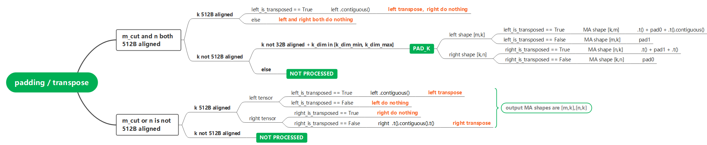
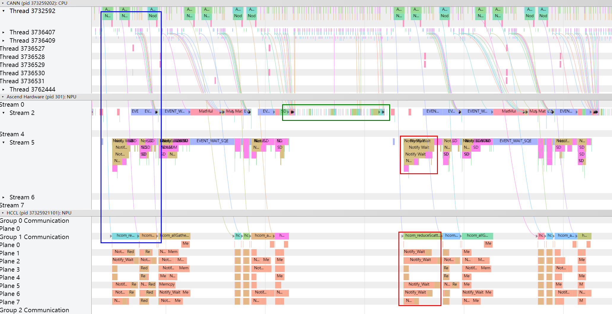
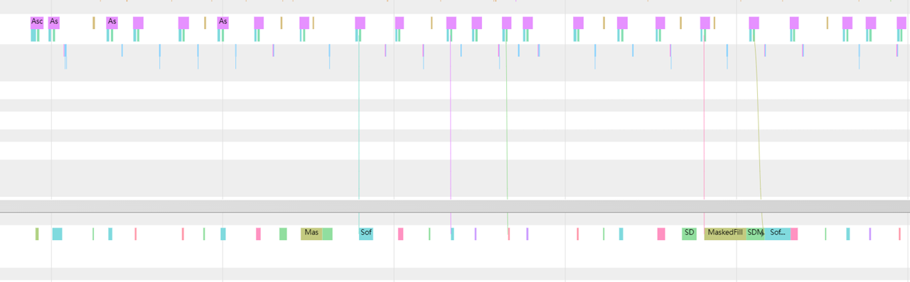
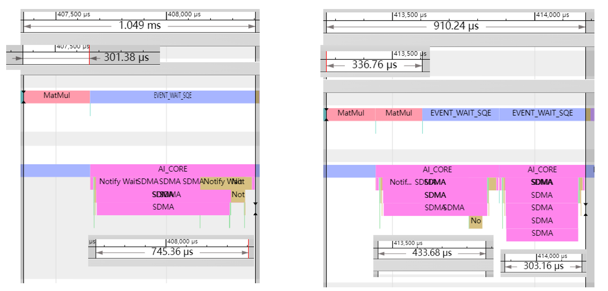
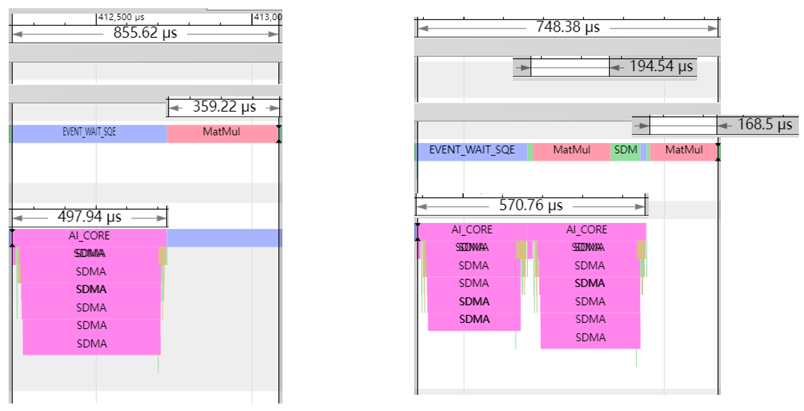
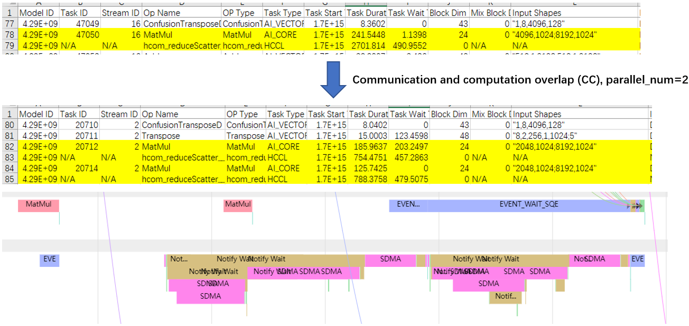
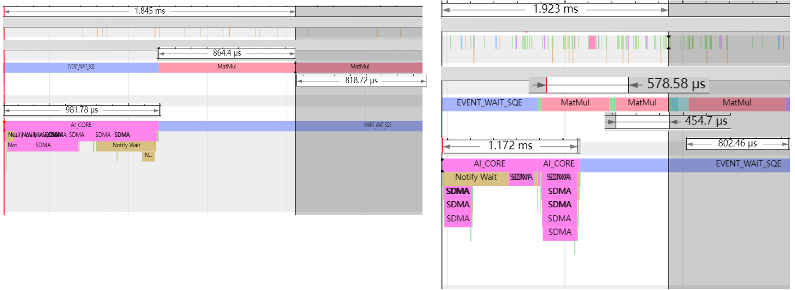

# Communication-Computation Overlap (CC) Use Guide #

## Installation and Configuration ##

### Installation ###

* AscendSpeed Installation:

To register cc in the framework: Import and call initialize_cc_from_cfg in ascendspeed/initialize.py as shown in the following code segment:

```python
from ascendspeed.core.tensor_parallel.user_config import initialize_cc_from_cfg

#...

def initialize_megatron(extra_args_provider=None, args_defaults=None,
                        ignore_unknown_args=False, allow_no_cuda=False):
    #...
    def finish_mpu_init():
        #...
        _set_random_seed(args.seed)
        initialize_cc_from_cfg(args)  #this line of code is added at the end of function fini
```

### Enabling or Disabling CC - Controlled by Environment Variables ###

Environment variables can be used to control whether to enable CC or not.

```shell
# Shuts off
export CC_PARALLEL_NUM=1
# Turns On
export CC_PARALLEL_NUM=2/4/8
```

In CC, the environment variable CC_PARALLEL_NUM indicates the number of divisions that left tensors are cut into. In the
rest of the document, **it will be referred to as 'parallel num'**. Currently, the parallel num can be only set to 1, 2,
4, or 8. The value 1 indicates that CC is not performed.

### Enabling Auxiliary Features (MANDATORY) - Controlled by Environment Variables ###

When CC is enabled, FFTS and memory reuse must be enabled. The settings of these two features are enabled through
environment variables as well, which gives as follows:

```shell
export HCCL_OP_BASE_FFTS_MODE_ENABLE=TRUE
export MULTI_STREAM_MEMORY_REUSE=1
```

### SoC-Friendly MATMUL Support ###

To boost the efficiency of Matmul computation on NPU, CC does a series of checks and operations (padding/transpose) to
both the left and right tensors, before dividing the left tensor into assigned number of parts.

The processing logic is as follows:



The logic can also be enabled or disabled manually, which is configured with the dictionary cc_cfgs defined in ./user_config.py.


### Customize CC Parallel Num Based on Matmul Shape ###

Sometimes, CC doe not benefit with Matmul operations of certain shapes. In this case, you can manually disable CC on
those Matmul operations based on their shapes. This can be achieved by modifying the dictionary cc_cfgs defined in ./user_config.py.

Furthermore, the same method could be used if you want to increase/decrease the parallel num of certain Matmul
operations while remaining CC enabled for them.

By default, the customized_cc is set as this:

```python
'customized_cc': { }
```

To assign a customized number of parallel num for the Matmul operation of shape \[m, k\] x \[k, n\], define the
customized_cc as follows:

```python
'customized_cc':{
    "[16384, 5120, 1920]":8, # Change the parallel num of Matmul with shape [16384, 5120] * [5120, 1920] to 8
    "[16384, 1920, 5120]":1 # Disable CC for Matmul with shape [16384, 5120] * [5120, 1920]
}
```

*Note: The key value of the dictionary must be entered in the form of string, with quotation marks.*

An example can be seen in the last Chapter called "When You Need to Disable CC for a Specific Shape of Matmul, or Set a
Larger Parallel Number for it".

### Recompute All-Gather ###

For ColumnParallelLinear, all-gather is performed on inputs in both forward and backward. It can be chosen whether to
save the communication output in ctx during forward so that no repeating communication is needed in backward.

Disabling the recomputation achieves higher speed in backward of ColumnParallelLinear, while consuming more memory.

The modification is also implemented by configuring cc_cfgs defined in ./user_config.py (recomputation is enabled by default).

### Attention ###

Check whether the ColumnParallelLinear and RowParallelLinear codes are changed in the model. If yes, modify the codes
correspondingly in min_comm directory.

## Tuning Process and Expected Result ##

In a model with normal compiling and executing environment (CANN package + torch_npu version), proper tuned Matmul and
CPU with satisfying capability, CC is expected to obtain 5% to 10% end-to-end performance gains. However, the expected
benefits may not be achieved due to multiple reasons. For example, the Matmul consumption proportion of the model is not
high enough, the host bound occurs and lowers the CPU capability, or significant communication waits are caused by speed
differences among devices. This section will explain in detail the process of tuning while enabling CC, and the ways
that can be tried to achieve higher performance gains when the issues mentioned above arise.

### Basic Implementation Process ###

Disable CC, that is,`export CC_PARALLEL_NUM=1`, run a baseline and save the profile. Then enable CC with the parallel
number of 4, that is,`export CC_PARALLEL_NUM=4`, run again and save the profile. Compare the end-to-end time between the
two runs.

* Note that two auxiliary features need to be enabled when running with CC. Which
  are, `export HCCL_OP_BASE_FFTS_MODE_ENABLE=TRUE` and `export MULTI_STREAM_MEMORY_REUSE=1`;
* When CC is enabled, the parallel num can be selected from 2/4/8. However, try 4 first, rarely use 8 and choose 2 only
  when 4 leads to specific problems (see below). A balance needs to be made between the benefits introduced by CC
  overlap and the extra communication burden due to the splitting of tensors.

### When Host Bound shows ###

This problem can be identified when the operator deliveries in the timeline are almost vertical. It may occur on all
devices or only on some of them. For example, communication operators are delivered almost vertically in the blue box in
the following figure. That is, some communication operators of the current device are not delivered in advance. As a
result, the execution of some communication operators may be seen with significant waits among different devices. (A lot
of Notify Waits in the red box attests to this). In addition, the operator execution on the NPU side is sparse (as shown
in the green box), which indicates that the operator is not delivered to the device in advance, and further proves that
the host bound exists.



When the host bound is severe, you may find the execution of operators on NPU start sparsely in time, as shown in the
following figure.



When host bound is shown, reduce the parallel num of CC to 2 to reduce the CPU pressure. You can also customize the
number of parallels for each linear computation, as described above in Chapter "Customize CC Parallel Num Based on
Matmul Shape".

### How to Identify CC from Timeline? ###

Currently, there are six CC segments in each forward and backward iteration. They are:

* Forward: ColumnParallelLinear before Softmax in Attention. Communication is performed before computation.
* Forward: RowParallelLinear after Softmax in Attention. Computation is performed before communication.
* Forward: ColumnParallelLinear before Sigmoid in the MLP (also called FFN). Communication is performed before
  computation.
* Forward: RowParallelLinear after Sigmoid in the MLP. Computation is performed before communication.
* Backward: In the backwards of MLP, the backward of RowParallelLinear before SigmoidGrad. Communication is performed
  before computation.
* Backward: In the backwards of Attention, the backward of RowParallelLinear before SoftmaxGrad. Communication is
  performed before computation.

You can find the positions of the corresponding parts based on the position of the Softmax, Sigmoid, SoftmaxGrad, and
SigmoidGrad operators. Note that each backward ParallelLinear process has two matmul processes, which compute grad_input
and grad_weight respectively (if grad_weight is required). Currently, only the computation of grad_input uses CC. That
is, at least one matmul in the backward of ParallelLinear will not be split.

### What is a Successful CC Segment?

The conditions for determining whether a parallel operation is successful are as follows:

* The total execution time of Matmul with CC is not significantly longer than that without CC (a little longer is normal
  due to splitting the tensors).
* The total communication execution time with CC is not significantly longer than that without CC (a little longer is a
  normal due to splitting the tensors).
* When computes first, the computation of second part overlaps with the communication of first part, etc.
* When communicates first, the communication of second part overlaps with the computation of first part, etc.
* The computation time is not significantly greater than the communication time, and vice versa.
* The total time of the computation and communication is reduced with CC applied.

Example 1: The following figure shows the CC process of computation before communication. (The left side disables CC,
and the right side enables CC with parallel num being 2.)



Example 2: The following figure shows the CC process of communication before computation. (The left side disables CC,
and the right side enables CC with parallel num being 2.)



### When the Proportion of Matmul Computation is Too Small ###

Sometimes, because Matmul itself is not very time-consuming and the time required to communicate with it is
significantly larger, it may not yield a significant performance gain by slicing it up. See the following figure.



In this case, you can try to reduce the number of parallels of the linear segment, or do not perform CC. For details
about how to set the parallel number for the linear computation of certain shapes, see the Chapter "Customize CC
Parallel Num Based on Matmul Shape".

### When Communication Increases Significantly after Slicing up  ###

If communication deterioration is relatively serious with CC enabled, that is, the sum of communication time after the
division is far greater than the communication time before the division, it indicates that communication deterioration
occurs in communication division introduced by CC. Try reduce parallel num of those certain linear segments.

### When You Need to Disable CC for a Specific Shape of Matmul, or Set a Larger Parallel Number for it ###

Find the positions of the six CC segments in the profiling based on the positions of them as described in Chapter "How
to Identify CC from Timeline?" and determine whether the CC segments are successful based on Chapter "What is a
Successful CC Segment?". If you want to set a different parallel num for a specific segment of CC, (increase or decrease
it, or disable CC, i.e., set it to 1), you can customize the number of parallel CC splits based on the description in
Chapter "Customize CC Parallel Num Based on Matmul Shape".

Example:



The preceding figure shows a backward timeline of RowParallelLinear, which is located before SigmoidGrad in the backward
process of MLP. You can see that the Matmul for computating grad_input is cut into two parts after the CC is enabled (as
shown in the right figure), but the Matmul for computing grad_weight is not split. However, the overall duration of this
part increases, indicating that CC is not applicable to this part and needs to be disabled.

Assume that the shape of the Matmul is \[4096, 1024\] multiplied by \[1024, 8192\] when CC is disabled. In this case,
you could disable CC for this specific shape of Matmul by modifying the dictionary cc_cfgs defined in ./user_config.py.
