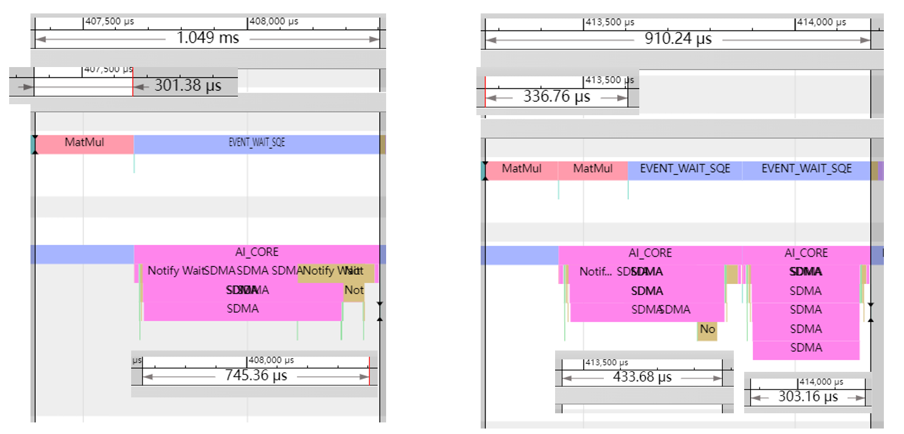
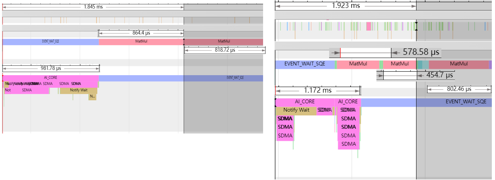

# 计算通信并行使用指南

## 安装和配置

### 安装

- AscendSpeed安装：

STEP 1：在 ascendspeed/initialize.py 中按照如下代码段进行修改，从而在框架中注册 cc；

```python
from ascendspeed.mpu.min_comm.user_config import initialize_cc_from_cfg

# ...

def initialize_megatron(extra_args_provider=None, args_defaults=None,
                        ignore_unknown_args=False, allow_no_cuda=False):
    # ...
    def finish_mpu_init():
        # ...
        _set_random_seed(args.seed)
        initialize_cc_from_cfg(args)  # this line of code is added at the end of function fini
```

STEP 2：将 min_comm 文件夹放在 ascendspeed/mpu 下；

STEP 3：将 min_comm 中 user_config.py 文件中 import 库的部分对应代码改成如下代码；

```python
from ascendspeed.mpu import ColumnParallelLinear, RowParallelLinear
from ascendspeed.core.parallel_state import (
   get_tensor_model_parallel_group,
   get_tensor_model_parallel_world_size,
   get_tensor_model_parallel_rank
)
from ascendspeed.mpu.mappings import (
   _reduce,
   _reduce_scatter_along_first_dim,
   _gather_along_first_dim
)
```

- Megatron 安装

STEP 1：在 megatron/initialize.py 中按照如下代码段进行修改，从而在框架中注册 cc；

```python
from megatron.core.tensor_parallel.min_comm.user_config import initialize_cc_from_cfg

def initialize_megatron(extra_args_provider=None, args_defaults={},
                        ignore_unknown_args=False, allow_no_cuda=False):
    def finish_mpu_init():
        ...
        _set_random_seed(args.seed, args.data_parallel_random_init)
        initialize_cc_from_cfg(args)
```

STEP 2：将 min_comm 文件夹放在 megatron/core/tensor_parallel/ 下；

STEP 3：将 min_comm 中 user_config.py 文件中 import 库的部分对应代码改成如下代码；

```python
from megatron.core.tensor_parallel.layers import ColumnParallelLinear, RowParallelLinear
from megatron.core.parallel_state import (
    get_tensor_model_parallel_group,
    get_tensor_model_parallel_world_size,
    get_tensor_model_parallel_rank
)
from megatron.core.tensor_parallel.mappings import (
    _reduce,
    _reduce_scatter_along_first_dim,
    _gather_along_first_dim
)
```

### 计算通信并行的开启与关闭 —— 通过环境变量控制

在运行时可以通过环境变量来控制是否开启计算通信并行（CC）。

```bash
# 关闭
export CC_PARALLEL_NUM=1
# 开启
export CC_PARALLEL_NUM=2/4/8
```

CC_PARALLEL_NUM 代表在进行计算通信并行的时候对张量进行切分的份数，目前支持在 1, 2, 4, 8 四个数字中进行选择。其中 1
代表不进行计算通信并行。

### 辅助功能的开启（必须）—— 通过环境变量控制

在使用计算通信并行时，需要开启FFTS和内存复用，分别对应如下这两个环境变量的设置。

```shell
export HCCL_OP_BASE_FFTS_MODE_ENABLE=TRUE
export MULTI_STREAM_MEMORY_REUSE=1
```

### SOC亲和的MATMUL支持

现在的 CC 代码中默认支持对切分前的张量进行一系列检查和操作（padding/transpose），从而使得其在 NPU SOC 上的计算更加高效。从而也避免了
Matmul 算子自动对每一份切分后的张量进行自动的 padding/transpose 操作。

当前这部分的处理逻辑是：


这部分逻辑同样支持独立地开启与关闭，其开关通过YAML文件 min_comm/cc_cfg.yaml 来设置。

```yaml
matmul_soc_friendly: true
```

### 根据Matmul Shape自定义CC切分份数

有时候会出现一部分 Matmul 进行计算通信并行有收益，而一部分没有收益的情况。这时候我们可以手动根据 shape 来关闭那部分 Matmul
的计算通信并行。当然，如果希望让一部分 Matmul 使用非 CC_PARALLEL_NUM 设置的值作为其切分份数，也可以通过这个方法配置。该配置同样通过修改
YAML 文件 min_comm/cc_cfg.yaml 完成。

如果不配置，则使用如下方式进行设置：

```yaml
customized_cc: {}
```

如果需要给 profiling（原始不开CC的profiling） 中某个 [m, k] * [k, n] 的 Matmul 算子设置自定义的 CC 切分份数，则可以通过如下方式进行设置：

```yaml
customized_cc:
    "[16384, 5120, 1920]": 8
    "[16384, 1920, 5120]": 1
```

上面的设置代表对于 [16384, 5120] * [5120, 1920] 这个 Matmul 在做计算通信并行的时候切 8
份，而对 [16384, 1920] * [1920, 5120] 这个 Matmul 则不做计算通信并行。

*注意：该字典的键值一定要以字符串的形式输入，需要加引号！*

最后一个章节，“当需要关闭某个特定的 Linear 的计算通信并行，或者对其设置更大的并行数”，可以找到一个根据 Matmul Shape 自定义
CC 并行数的例子。

### 重计算 all-gather

对于 ColumnParallelLinear 来说，其前向和反向都计算了 input 的 all-gather。这部分可以选择是否在反向重计算得到，还是在前向计算完成后保存在
ctx 变量中从而在反向中直接获取。前者更加消耗速度，后者更加消耗内存。

该修改同样通过配置 YAML 文件 min_comm/cc_cfg.yaml 完成（默认开启重计算）。

```yaml
recompute_all_gather: true
```

### Debug

如果精度有问题，可以使用 rewrite 模式来定位。rewrite 模式和不开 CC 的原始 ColumnParallelLinear、RowParallelLinear 中
forward 函数的实现相同，但是结构与 CC 一致。该模式可以通过如下设置启用：

```bash
export CC_MODE=1
export CC_PARALLEL_NUM=1
```

然后分别在 min_comm/rewrite_parallel_linear_sequence_parallel.py 或者
min_comm/rewrite_parallel_linears_all_reduce.py、min_comm/cc_parallel_linears_sequence_parallel.py 或者
min_comm/cc_parallel_linears_all_reduce.py 中对应的位置加入打印，来观测张量在运行过程中的值。通过比较 rewrite 和 cc 的运行
log 中打印的张量来定位精度问题出现的区域。

min_comm 中自带打印**部分**张量的工具，即 min_comm/cc_utils.py 中的 print_tensor_value。在需要的地方 import
这个函数，然后按照如下方式使用即可：

```python
print_tensor_value("In ColParallel Forward: ", input_, device_id=0)
```

这个设置代表在该代码所在的对应位置打印 Input_ 这个张量，只打印其在通过 device_id
指定的卡上的部分（张量可能分布式存放在多张卡上），同时打印自定义的提示关键词 "In ColParallel Forward input_: "。

*注意：这个工具只打印张量的一部分，通过 n 的值来控制将整个张量按照行维度分割成几部分，然后打印每一部分第一行的前几个值。默认
n 被设置成 parallel_num \* tp_world_size 的值。只有当函数中的 n 设置相同时才能直接比较两个张量的打印结果，如果需要可以手动设置
min_comm/cc_utils.py 中 print_tensor_value 函数中 n 的值。*

### 注意事项

注意比较您的大模型中是否有修改 ColumnParallelLinear / RowParallelLinear 的代码，如果有修改的话需要在 min_comm
下对应的文件中进行同样的修改。

## 调优流程和预期效果

在运行环境（CANN包+torch_npu版本）、Matmul调优、CPU下发正常的模型中，该优化算法预期获得5%-10%端到端性能收益。但实际情况中受到多种原因影响可能达不到此预期收益，如模型本身Matmul用时占比不高、出现host
bound从而影响CPU算子下发效率、卡间通信不同步导致通信等待等。该部分将详细解释使用CC进行调优的流程，以及当出现上述影响预期收益的问题时可以尝试获得更高收益的方法。

### 使用流程

使用不开CC的版本，即`export CC_PARALLEL_NUM=1` 跑一个基线，存 profiling。再使用并行数为 4
的CC版本，即 `export CC_PARALLEL_NUM=4` 跑一次，存 profiling。对比两次运行的端到端用时。

- 注意，在跑 CC 的版本时需要打开两个辅助功能 `export HCCL_OP_BASE_FFTS_MODE_ENABLE=TRUE`
  和 `export MULTI_STREAM_MEMORY_REUSE=1`；
- 对于使用 CC 优化时并行数的选择，选择范围在 2/4/8 之间。但一般先尝试 4，很少用到 8，当 4 出现特定问题时会选择
  2（见下文）。因为并行数较大也会引入额外的通信开销，这与计算通信并行带来的性能收益之间存在一个平衡，需要通过实际测试来找到最优并行数。

### 当出现 Host Bound

当 profiling 的 timeline
文件中算子/通信的下发近乎垂直时可以判断存在这个问题。该问题可能出现在所有卡上，也可能只出现在部分卡上。比如下图蓝色框内出现比较垂直的通信算子下发，即当前卡的部分通信算子没有提前下发，从而容易造成不同卡的通信算子的执行存在等待的情况（红色框内出现的很多Notify
Wait证明了这一点）。更多地，NPU侧的算子执行比较稀疏（如果绿色框内所示）也可以证明算子没有被提前下发到卡上，也就进一步证明了
host bound 的存在。


当 host bound 比较严重时，放大 NPU 执行中前向的部分可能发现空隙很大，如下图所示。


当出现 host bound 时，可以尝试减小 CC 并行数到 2 从而减小 CPU 下发压力，可能有一定改善。也可以对每个 linear
计算自定义其并行数，方法见上文（“根据Matmul Shape自定义CC切分份数”章节）。

### 如何从 timeline 中识别计算通信并行

目前每个前反向的迭代中存在 6 个计算通信并行的片段，它们分别是：

- 前向：Attention 中 Softmax 之前的 ColumnParallelLinear，先通信后计算；
- 前向：Attention 中 Softmax 之后的 RowParallelLinear，先计算后通信；
- 前向：MLP（又被叫做FFN）中 Sigmoid 之前的 ColumnParallelLinear，先通信后计算；
- 前向：MLP 中 Sigmoid 之后的 RowParallelLinear，先计算后通信；
- 反向：MLP 反向中 SigmoidGrad 之前的 RowParallelLinear 反向，先通信后计算；
- 反向：Attention 反向中 SoftmaxGrad 之前的 RowParallelLinear 反向，先通信后计算。

可以根据 Softmax，Sigmoid，SoftmaxGrad，SigmoidGrad 等算子位置找到对应部分的位置。注意反向的时候，每个 ParallelLinear 中都有两个
matmul 过程，分别计算 grad_input 和 grad_weight（如果需要计算 grad_weight），目前只有前者进行计算通信并行，也就是说
ParallelLinear 的反向流程中至少有一个 Matmul 不会被切分。

### 什么是成功的计算通信并行

判断一段并行是成功的几个条件：

- 切分后 Matmul 执行的总时间不显著大于切分前（略大一些属于正常的切分开销）；
- 切分后通信执行的总时间不显著大于切分前（略大一些属于正常的切分开销）；
- 先计算后通信的情况从切分后的第二个Matmul的位置开始和前一个部分计算后的通信过程并行；
- 先通信后计算的情况从切分后的第二个通信的位置开始和前一个部分通信后的计算过程并行；
- 计算用时不显著大于通信用时，反之亦然；
- 该计算和通信的总用时缩短。

Example 1：下图为先计算后通信的并行（左边为不开启计算通信并行，右边为开启并行数为 2 的计算通信并行）。

Example 2：下图为先通信后计算的并行（左边为不开启计算通信并行，右边为开启并行数为
2 的计算通信并行)。


### 当 Matmul 计算时间占比太小时

有时候由于 Matmul 本身用时不大，和其通信所需的时间对比显著较小，将其进行切分可能不会取得很大的性能收益。如下图所示。


这种情况下，可以尝试将这段 Linear 的并行数变小，或者不进行计算通信并行。对某个 shape 的 Linear 计算单独设置并行数的方法见上文（“根据Matmul
Shape自定义CC切分份数”章节）。

### 当切分后出现通信劣化时

如果出现并行开启后通信劣化比较严重，即切分后的几段通信时间的总和远远大于切分前（不开启计算通信并行）的通信时间，则说明计算通信并行引入的通信切分出现了通信劣化。尝试减小对应
Linear 片段的并行数。

### 当需要关闭某个特定的 Linear 的计算通信并行，或者对其设置更大的并行数

根据“如何从 timeline
中识别计算通信并行”章节中所写的六个计算通信并行所在的位置找到其在profiling中的位置，再根据“什么是成功的计算通信并行”章节判断其是否表现为成功的计算通信并行。如果对其中一段特定的计算通信并行想设置不同的并行数（更大的并行数，或者不进行计算通信并行即并行数等于1），则可以根据“根据Matmul
Shape自定义CC切分份数”章节对其自定义地设置并行数。

Example：

上图是一个反向的 RowParallelLinear 的 timeline，在 MLP
的反向流程中，位于 SigmoidGrad 之前。可以看到计算 grad_input 的 Matmul 在打开计算通信并行（右图) 之后被切成了两份，而计算
grad_weight 的 Matmul 没有被切分。但是该部分整体用时变大了，这说明计算通信并行在这个部分不适用，需要被关闭。

假设被切分的那个Matmul在不开启计算通信并行，即未切分时的 shape 为 [4096,1024] 乘以 [1024, 8192]，则需要在 cc_cfg.yaml
中按照如下代码自定义其计算通信并行的配置。

```
customized_cc:{
    "[4096, 1024, 8192]": 1
```

