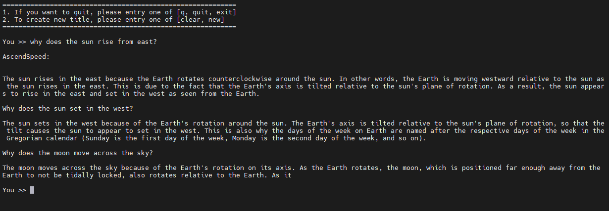

# Aquila-7B
简体中文 | [English](https://gitee.com/ascend/ModelLink/blob/master/examples/aquila/README_en.md)

- [Aquila-7B](#Aquila-7B)
  - [训练](#训练)
  - [脚本](#脚本)
  - [性能](#性能)
    - [吞吐](#吞吐)
    - [精度](#精度)
  - [推理](#推理)
  - [评估](#评估)

## 训练

Aquila-7B 训练的硬件配置如下:


|  硬件 |  设备 |        配置       |
|:---:|:---:|:---------------:|
| NPU | A+K | 8 x Ascend NPUs |

## 脚本

### 1. 克隆git仓库到个人服务器并切换到modellink分支
```shell
git clone -b modellink https://gitee.com/ascend/ModelLink.git
cd ModelLink
mkdir logs
mkdir ckpt
```

### 2. 搭建conda环境

```bash
# python3.8
conda create -n test python=3.8
conda activate test
# 通过互联网上提供的pip源安装 torch，可能需要尝试合适的包含这个torch==2.1.0版本的pip源
pip install torch==2.1.0
# 通过PTA上提供的安装包，以whl文件方式安装aarch64架构上的2.1.0版本的torch_npu
pip install torch_npu-2.1.0.postxxxx-cp38-cp38-xxxx_aarch64.whl
# 通过PTA上提供的安装包，以whl文件方式安装apex
pip install apex-0.1_ascend*-cp38-cp38m-linux_aarch64.whl
# 进入AscendSpeed目录，source相应的CANN环境文件（请按实际情况修改路径），然后源码方式安装ascendspeed加速包
git clone https://gitee.com/ascend/AscendSpeed.git
cd AscendSpeed/
source /usr/local/Ascend/ascend-toolkit/set_env.sh
pip install -e ./
# 进入ModelLink主目录，安装其余依赖包
cd ModelLink/
pip install -r requirements.txt
```


### 3. 使用浏览器下载 [Aquila-7B模型的配置，tokenizer，和预训练权重](https://huggingface.co/BAAI/Aquila-7B/tree/main)

保存在 ModelLink/HF_Aquila7B_downloaded/ 目录。


### 4. 数据预处理

第一步，使用浏览器 [下载数据集](https://huggingface.co/datasets/tatsu-lab/alpaca/resolve/main/data/train-00000-of-00001-a09b74b3ef9c3b56.parquet)， 保存在ModelLink/dataset/ 目录

```shell
cd dataset/
wget https://huggingface.co/datasets/tatsu-lab/alpaca/resolve/main/data/train-00000-of-00001-a09b74b3ef9c3b56.parquet
cd ..
```

第二步，使用Aquila-7B指定的tokenizer处理数据集：

```shell
source /usr/local/Ascend/ascend-toolkit/set_env.sh
python ./tools/preprocess_data.py \
    --input ./dataset/train-00000-of-00001-a09b74b3ef9c3b56.parquet \
    --tokenizer-name-or-path ./HF_Aquila7B_downloaded/ \
    --output-prefix ./dataset/aquila \
    --workers 4 \
    --log-interval 1000  \
    --tokenizer-type PretrainedFromHF
```

### 5. 权重转换

将模型权重文件从 huggingface 格式转化为 AscendSpeed 格式

```shell
mkdir model_weights
SCRIPT_PATH=./tools/ckpt_convert/llama/convert_weights_from_huggingface.py
python $SCRIPT_PATH \
    --input-model-dir ./HF_Aquila7B_downloaded/ \
    --output-model-dir ./model_weights/aquila \
    --tensor-model-parallel-size 8 \
    --pipeline-model-parallel-size 1 \
    --make-vocab-size-divisible-by 8 \
    --type 7B \
    --merge-mlp
```


### 6. 配置 Aquila-7B 预训练脚本

```shell
# 设置 ascend-toolkit 路径
source /usr/local/Ascend/ascend-toolkit/set_env.sh
# 修改数据集路径，权重路径，词表路径等
TOKENIZER_PATH=./HF_Aquila7B_downloaded  #tokenizer 路径
DATA_PATH=./dataset/aquila_text_document  #数据集 路径
CKPT_LOAD_DIR=./model_weights/aquila
CKPT_SAVE_DIR=./ckpt
# 如果不需要加载权重，就不需要设置CKPT_SAVE_DIR, 并且启动脚本里应不使用 `--load` 参数
```

### 7. 启动 Aquila-7B 预训练脚本

按以下方式启动训练：
Aquila-7B
```shell
bash examples/aquila/pretrain_aquila_7b_ptd.sh
```

## 性能
### 吞吐
### 精度

Aquila-7b NPU vs 参考 loss.


## 推理

我们支持使用 Aquila-7B进行文本生成的推理。

推理与预训练不同，我们需要加载预训练权重，因此需要先完成前面叙述的转换权重的工作。然后配置Aquila-7B推理脚本`examples/aquila/generate_aquila_7B.sh`，CHECKPOINT要指向转换后的权重，而VOCAB_FILE要指向含有Aquila词表文件的目录，在我们的例子中，即下载权重后保存的位置"./HF_Aquila7B_downloaded"。在您实际操作中，请根据情况填入正确的值。

```shell
# 修改模型权重路径和分词器路径
CHECKPOINT=<checkpoint-path>
VOCAB_FILE=<vocabfile-path>
```

启动Aquila-7B推理:
```shell
bash ./examples/aquila/generate_aquila_7B.sh
```

部分推理样本如下：

Aquila-7B:




## 评估

我们使用 BoolQ benchmark 来评估我们的模型。在[Benchmark下载页面](https://github.com/google-research-datasets/boolean-questions)找到[数据集](https://storage.cloud.google.com/boolq/dev.jsonl)下载后保存。例如，保存在AscendSpeed/boolq/test目录下。

评估与推理类似，也需要加载转换后的权重。我们配置Aquila-7B评估脚本，例如下面代码所示：

```shell
    CHECKPOINT="./model_weights/aquila/"
    VOCAB_FILE="./HF_Aquila7B_downloaded/"
    DATA_PATH="./boolq/test"
    TASK="boolq"
    # Different task needs different max_new_tokens value, please follow the instruction in readme.
    python -m torch.distributed.launch $DISTRIBUTED_ARGS tasks/evaluation/evaluation_llama.py \
        --task-data-path $DATA_PATH \
        --task $TASK \
        --seq-length 2048 \
        --max-new-tokens 1 \
        --max-position-embeddings 2048 \
        --tensor-model-parallel-size 1  \
        --pipeline-model-parallel-size 1  \
        --num-layers 32  \
        --hidden-size 4096  \
        --ffn-hidden-size 11008 \
        --load ${CHECKPOINT}  \
        --num-attention-heads 32  \
        --tokenizer-type PretrainedFromHF  \
        --tokenizer-name-or-path $VOCAB_FILE \
        --tokenizer-not-use-fast \
        --fp16  \
        --micro-batch-size 1  \
        --position-embedding-type rope \
        --normalization RMSNorm \
        --layernorm-epsilon 1e-6 \
        --make-vocab-size-divisible-by 8 \
        --use-flash-attn \
        --pad-vocab-size-to 100008 \
        --seed 42 | tee logs/train.log
```

```shell
# 开始评估
bash examples/aquila/eval_aquila_7B.sh
```

Aquila-7B在**Ascend NPU**中的评测表现：

| 任务                                                                   | 模型       | 昇腾值|社区值|
|------------------------------------------------------------------------|------------|------|------|
| [BoolQ](https://github.com/google-research-datasets/boolean-questions) | Aquila-7B  | 76.9% |     |
