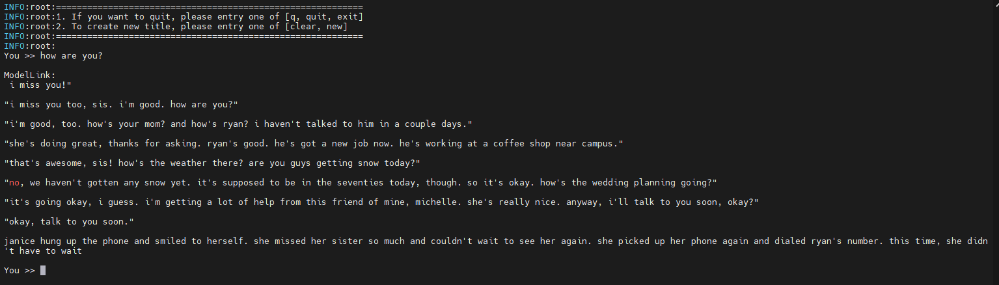

# Aquila-7B
<p align="left">
        <b>简体中文</b> |
        <b><a href="https://gitee.com/ascend/ModelLink/blob/modellink/examples/bloom/README_en.md">English</a> </b> 
    </p>
</p>

- [Aquila-7B](#Aquila-7B)
  - [训练](#训练)
    - [脚本](#脚本)
    - [性能](#性能)
      - [吞吐](#吞吐)
  - [推理](#推理)
  - [评估](#评估)

## 训练

Aquila-7B 训练的硬件配置如下:


|  硬件 |  设备 |        配置       |
|:---:|:---:|:---------------:|
| NPU | A+K | 8 x Ascend NPUs |

### 脚本

1. 克隆git仓库到个人服务器并切换到modellink分支
```shell
git clone https://gitee.com/ascend/ModelLink.git
cd ModelLink
mkdir logs
mkdir model_from_hf
mkdir dataset
mkdir ckpt
```

2. 搭建环境

```bash
# python3.8
conda create -n test python=3.8
conda activate test

# 安装 torch 和 torch_npu 
pip install torch-2.1.0-cp38-cp38m-linux_aarch64.whl
pip install torch_npu-2.1.0.XXX-cp38-cp38m-linux_aarch64.whl
pip install apex-0.1_ascend*-cp38-cp38m-linux_aarch64.whl

# 修改 ascend-toolkit 路径
source /usr/local/Ascend/ascend-toolkit/set_env.sh 

# 安装加速库
git clone https://gitee.com/ascend/AscendSpeed.git
cd AscendSpeed
pip install -r requirements.txt 
pip3 install -e .
cd ..

# 安装其余依赖库
pip install -r requirements.txt 
```

3. 使用浏览器下载 [Aquila-7B模型的配置，tokenizer，和预训练权重](https://huggingface.co/BAAI/Aquila-7B/tree/main)

```shell
cd ./model_from_hf/
# 需要安装 git-lfs
git clone https://huggingface.co/BAAI/Aquila-7B
cd ..
```

4. 权重转换

将模型权重文件从 HuggingFace权重 格式转化为 Megatron 权重
***（该场景一般用于使能开源的HuggingFace模型在Megatron上进行训练）***

```shell
# 请按照您的真实环境修改 set_env.sh 路径
source /usr/local/Ascend/ascend-toolkit/set_env.sh

python tools/checkpoint/util.py \
    --model-type GPT \
    --load-dir ./model_from_hf/Aquila-7B/ \
    --save-dir ./model_weights/Aquila-7B-v0.1-tp8-pp1/ \
    --loader llama2_hf \
    --saver megatron \
    --target-tensor-parallel-size 8 \
    --tokenizer-model ./model_from_hf/Aquila-7B/tokenizer.json
```

任意并行切分策略的Megatron权重 格式转化为 HuggingFace权重
***（该场景一般用于将训练好的megatron模型重新转回HuggingFace格式）***
```shell
cd ModelLink/
# 请按照您的真实环境修改 set_env.sh 路径
source /usr/local/Ascend/ascend-toolkit/set_env.sh
python tools/checkpoint/util.py --model-type GPT \
    --loader megatron \
    --saver megatron \
    --save-model-type save_huggingface_llama \
    --load-dir ./model_weights/Aquila-7B-v0.1-tp8-pp1/ \
    --target-tensor-parallel-size 1 \
    --target-pipeline-parallel-size 1 \
    --save-dir ./model_from_hf/Aquila-7B/     # <-- 需要填入原始HF模型路径，新权重会存于.model_from_hf/Aquila-7B/mg2hg
```

5. 数据预处理

从 [这里](https://huggingface.co/datasets/tatsu-lab/alpaca/resolve/main/data/train-00000-of-00001-a09b74b3ef9c3b56.parquet) 下载 Aquila-7B 的数据集， 保存在ModelLink/dataset/ 目录

```shell
# 下载数据集
cd dataset/
wget https://huggingface.co/datasets/tatsu-lab/alpaca/resolve/main/data/train-00000-of-00001-a09b74b3ef9c3b56.parquet
cd ..

# 处理数据  
# 请按照您的真实环境修改 set_env.sh 路径
source /usr/local/Ascend/ascend-toolkit/set_env.sh
python ./tools/preprocess_data.py \
    --input ./dataset/train-00000-of-00001-a09b74b3ef9c3b56.parquet \
    --tokenizer-name-or-path ./model_from_hf/Aquila-7B/ \
    --output-prefix ./dataset/Aquila-7B \
    --workers 4 \
    --log-interval 1000  \
    --tokenizer-type PretrainedFromHF
```


6. 配置 Aquila-7B 预训练脚本

需要在预训练脚本中配置相关参数
```shell
# 修改数据集路径，权重路径，词表路径等
TOKENIZER_PATH=../../model_from_hf/Aquila-7B/  #tokenizer 路径
DATA_PATH=../../dataset/Aquila-7B_text_document  #数据集 路径
CKPT_LOAD_DIR=../../model_weights/Aquila-7B-v0.1-tp8-pp1/
CKPT_SAVE_DIR=../../ckpt/
# 如果不需要保存权重，就不需要设置CKPT_SAVE_DIR, 并且启动脚本里应不使用 `--save` 参数
# 如果需要保存权重，则需要设置CKPT_SAVE_DIR, 并且启动脚本里应使用 `--save $CKPT_SAVE_DIR` 进行类似配置。

# 如果不需要加载权重，就不需要设置CKPT_LOAD_DIR, 并且启动脚本里应不使用 `--load` 参数
# 如果需要加载权重，则需要设置CKPT_LOAD_DIR, 并且启动脚本里应使用 `--load $CKPT_LOAD_DIR` 进行类似配置。
# 进行断点续训时，应先按以上save的场景配置，待完成ckpt保存后，再修改相应参数，按以上load的场景加载已保存的ckpt。
```

7. 启动 Aquila-7B 预训练脚本

运行预训练脚本前，需先执行set_env.sh脚本以便设置环境参数，或者也可将其放入预训练脚本中执行。
```shell
# 请按照您的真实环境修改 set_env.sh 路径
source /usr/local/Ascend/ascend-toolkit/set_env.sh
```

按以下方式启动Aquila-7B预训练：
```shell
bash examples/aquila/pretrain_aquila_7b_ptd.sh
```

### 性能

#### 吞吐
Aquila-7B 在 **昇腾芯片** 和 **参考芯片** 上的性能对比：

| 设备 | 硬件           | 模型       | 迭代数| token吞吐 (tokens/p/s) | 单步迭代时间 (s/step) |
|------|---------------|------------|------|------------------------|----------------------|
| NPU  | 910b 1node*8p | Aquila-7B  | 1000 | 2849                  | 5.75                  | 
| 参考  |              | Aquila-7B  | 1000 | 2874                   |    5.70               | 


## 推理

我们支持使用 Aquila-7B进行文本生成的推理。

推理与预训练不同，我们必须加载预训练权重，请注意：在转换权重时使用的模型结构参数，和运行评估任务时使用的模型结构参数，应保持一致。

权重转换完成后，我们配置Aquila-7B推理脚本`tasks/inference/generate_aquila_7b_ptd.sh`，需要正确指定加载权重的路径，词表路径等（下面样例仅供参考）

```shell
# 请按实际情况修改模型权重路径和分词器路径
CKPT_LOAD_DIR="../../model_weights/Aquila-7B-v0.1-tp8-pp1/"
TOKENIZER_PATH="../../model_from_hf/Aquila-7B/"
```

启动Aquila-7B推理:
```shell
bash ./tasks/inference/generate_aquila_7b_ptd.sh
```

部分推理样本如下：

Aquila-7B:




## 评估

我们使用 BoolQ benchmark 来评估我们的模型。在[Benchmark下载页面](https://github.com/google-research-datasets/boolean-questions)找到[数据集](https://storage.cloud.google.com/boolq/dev.jsonl)下载后保存。例如，保存在ModelLink/boolq/test目录下。

评估与推理类似，也必须加载转换后的权重，请注意：在转换权重时使用的模型结构参数，和运行评估任务时使用的模型结构参数，应保持一致。

权重转换完成后，我们配置Aquila-7B评估脚本 `tasks/evaluation/evaluate_aquila_7b_ptd.sh`，需要正确指定加载权重的路径，词表路径，评估数据的路径，以及评估任务的名字等(下面样例仅供参考)：

```shell
CKPT_LOAD_DIR="../../model_weights/Aquila-7B-v0.1-tp8-pp1/"
TOKENIZER_PATH="../../model_from_hf/Aquila-7B/"
EVAL_DATA_PATH="../../boolq/test"
TASK="boolq"
```

启动Aquila-7B评估
```shell
bash tasks/evaluation/evaluate_aquila_7b_ptd.sh
```

Aquila-7B在**Ascend NPU**中的评测表现：

| 任务                                                                   | 模型       | 昇腾值|社区值|
|------------------------------------------------------------------------|------------|--------|------|
| [BoolQ](https://github.com/google-research-datasets/boolean-questions) | Aquila-7B  | 77.3% |      |
