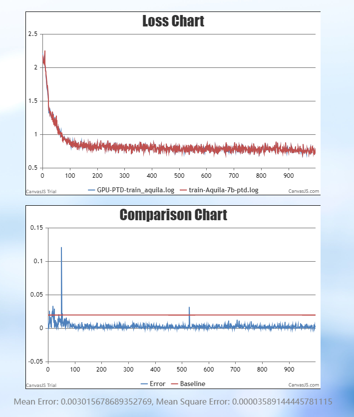

# Aquila-7B

<p align="left">
        <b><a href="https://gitee.com/ascend/ModelLink/blob/master/examples/aquila/README.md">简体中文</a></b> |
        <b>English</b>
    </p>
</p>


- [Aquila-7B/13B](#aquila-7b)
  - [Training](#training)
    - [Script](#script)
    - [Performance](#performance)
      - [Accuracy](#accuracy)
## Training

Here's a hardware summary of pre-training Aquila-7B:

| Hardware | Device |      Value       |
|:--------:|:------:|:----------------:|
|   NPU    |  A+K   | 8 x Ascend NPUs  |

### Script

#### 1. Clone the repository to your local server:
```shell
git clone https://gitee.com/ascend/ModelLink.git
cd ModelLink
mkdir logs
mkdir ckpt
```

#### 2. Build environment

```bash
# python3.8
conda create -n test python=3.7
conda activate test
# install torch and torch_npu
pip install torch==2.1.0
pip install torch_npu-2.1.0.postxxxx-cp38-cp38-xxxx_aarch64.whl
# install apex
pip install apex-0.1_ascend*-cp38-cp38m-linux_aarch64.whl
# install deepspeed and deepspeed_npu
pip install deepspeed==0.9.2
git clone https://gitee.com/ascend/DeepSpeed.git -b v0.9.2 deepspeed_npu
cd deepspeed_npu
pip3 install -e ./
cd ..
# enter the AscendSpeed/ directory，install ascendspeed package by source code
cd AscendSpeed/
pip install -e ./
# enter the ModelLink/ directory and install other packages
cd ModelLink/
pip install -r requirements.txt
```


#### 3. Download the Aquila-7B model, config, and tokenizer from [here](https://huggingface.co/BAAI/Aquila-7B/tree/main)

save to ModelLink/HF_Aquila7B_downloaded/ directory.


#### 4. Prepare dataset.

step1: Download the datasets from [here](https://huggingface.co/datasets/tatsu-lab/alpaca/resolve/main/data/train-00000-of-00001-a09b74b3ef9c3b56.parquet), save to ModelLink/dataset/ directory.

```shell
cd dataset/
wget https://huggingface.co/datasets/tatsu-lab/alpaca/resolve/main/data/train-00000-of-00001-a09b74b3ef9c3b56.parquet
cd ..
```


step2: use Aquila-7B specified tokenizer to pre-process data:


```shell
source /usr/local/Ascend/ascend-toolkit/set_env.sh
python ./tools/preprocess_data.py \
    --input ./dataset/train-00000-of-00001-a09b74b3ef9c3b56.parquet \
    --tokenizer-name-or-path ./HF_Aquila7B_downloaded/ \
    --output-prefix ./dataset/aquila \
    --workers 4 \
    --log-interval 1000  \
    --tokenizer-type PretrainedFromHF
```

#### 5. Weights convert

convert the model pre-training weights.

```shell
mkdir model_weights
SCRIPT_PATH=./tools/ckpt_convert/llama/convert_weights_from_huggingface.py
python $SCRIPT_PATH \
    --input-model-dir ./HF_Aquila7B_downloaded/ \
    --output-model-dir ./model_weights/aquila \
    --tensor-model-parallel-size 8 \
    --pipeline-model-parallel-size 1 \
    --make-vocab-size-divisible-by 8 \
    --type 7B \
    --merge-mlp
```


#### 6. Config Aquila-7B pre-training script.

```shell
# modify the script according to your own  ascend-toolkit path
source /usr/local/Ascend/ascend-toolkit/set_env.sh
# modify script orign dataset path according to your own dataset path
TOKENIZER_PATH=./HF_Aquila7B_downloaded    #tokenizer path
DATA=./dataset/aquila_text_document   #processed dataset
CHECKPOINT=./model_weights/aquila
```
*Note that if you do not load weights for pre-training, remove the `--load` parameter from the training script*

#### 7. Launch Aquila-7B pre-training script.

start training Aquila-7B model:
```shell
bash examples/aquila/pretrain_aquila_7b_ptd.sh
```
### Performance
#### Accuracy

Aquila-7B NPU vs Reference loss.
