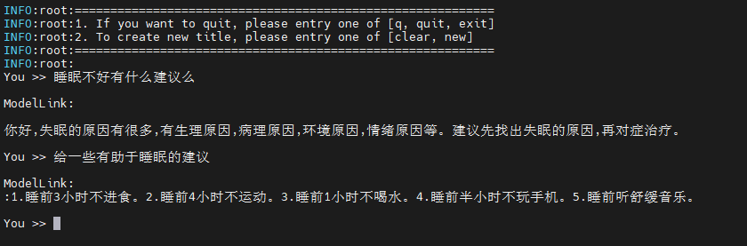
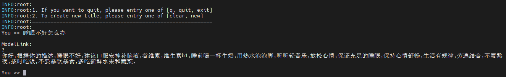

# BaiChuan2
<p align="left">
        <b>简体中文</b> |
        <b><a href="README_en.md">English</a> </b> 
    </p>
</p>


#  目录
- [Baichuan2-7B](#Baichuan2-7B)
  - [训练](#训练)
    - [脚本](#脚本)
    - [性能](#性能)
        - [吞吐](#吞吐)
  - [推理](#推理)
  - [评估](#评估)

- [Baichuan2-13B](#Baichuan2-13B)
  - [训练](#训练)
    - [脚本](#脚本)
    - [性能](#性能)
        - [吞吐](#吞吐)
  - [推理](#推理)
  - [评估](#评估)

# Baichuan2-7B

## 训练
Baichuan2-7B 训练的硬件配置如下：

|  硬件 |       配置        |
|:---:|:---------------:|
| NPU | 8 x Ascend NPUs |

### 脚本

1. 拷贝代码仓到本地服务器
```shell
git clone https://gitee.com/ascend/ModelLink.git
cd ModelLink
git clone https://gitee.com/ascend/ModelLink.git
cd ModelLink
mkdir logs
mkdir model_from_hf
mkdir dataset
mkdir model_from_hf
mkdir dataset
mkdir ckpt
```

2. 搭建环境

```bash
# python3.8
conda create -n test python=3.8
conda activate test

# 安装 torch 和 torch_npu 
pip install torch-2.1.0-cp38-cp38m-linux_aarch64.whl
pip install torch_npu-2.1.0.XXX-cp38-cp38m-linux_aarch64.whl
pip install apex-0.1_ascend*-cp38-cp38m-linux_aarch64.whl

# 修改 ascend-toolkit 路径
source /usr/local/Ascend/ascend-toolkit/set_env.sh 

# 安装加速库
git clone https://gitee.com/ascend/AscendSpeed.git
cd AscendSpeed
pip install -r requirements.txt 
pip3 install -e .
cd ..

# 安装其余依赖库
pip install -r requirements.txt 
```

3. 下载 Baichuan2-7B-Base [词表文件](https://huggingface.co/baichuan-inc/Baichuan2-7B-Base/tree/main) 
3. 下载 Baichuan2-7B-Base [词表文件](https://huggingface.co/baichuan-inc/Baichuan2-7B-Base/tree/main) 

```shell
cd ./model_from_hf/
# 需要安装 git-lfs: git lfs install
git clone https://huggingface.co/baichuan-inc/Baichuan2-7B-Base
cd ..
```

4. 权重格式转换
4. 权重格式转换

将模型权重文件从 HuggingFace权重 格式转化为 Megatron 权重
***（该场景一般用于使能开源的HuggingFace模型在Megatron上进行训练）***


```shell
# 修改 ascend-toolkit 路径
source /usr/local/Ascend/ascend-toolkit/set_env.sh
   
python tools/checkpoint/util.py \
    --model-type GPT \
    --loader llama2_hf \
    --saver megatron \
    --target-tensor-parallel-size 8 \
    --load-dir ./model_from_hf/Baichuan2-7B-Base/ \
    --save-dir ./model_weights/Baichuan2-7B-Base-v0.1-tp8-pp1/ \
    --tokenizer-model ./model_from_hf/Baichuan2-7B-Base/tokenizer.model \
    --load-dir ./model_from_hf/Baichuan2-7B-Base/ \
    --save-dir ./model_weights/Baichuan2-7B-Base-v0.1-tp8-pp1/ \
    --tokenizer-model ./model_from_hf/Baichuan2-7B-Base/tokenizer.model \
    --params-dtype bf16 \
    --w-pack True    
```

任意并行切分策略的Megatron权重 格式转化为 HuggingFace权重
***（该场景一般用于将训练好的megatron模型重新转回HuggingFace格式）***


```shell
# 请按照您的真实环境修改 set_env.sh 路径
source /usr/local/Ascend/ascend-toolkit/set_env.sh
python tools/checkpoint/util.py --model-type GPT \
    --loader megatron \
    --saver megatron \
    --save-model-type save_huggingface_llama \
    --load-dir ./model_weights/Baichuan2-7B-Base-v0.1-tp8-pp1/ \
    --load-dir ./model_weights/Baichuan2-7B-Base-v0.1-tp8-pp1/ \
    --target-tensor-parallel-size 1 \
    --target-pipeline-parallel-size 1 \
    --w-pack True \
    --save-dir ./model_from_hf/Baichuan2-7B-Base/     # <-- 需要填入原始HF模型路径，新权重会存于./model_from_hf/Baichuan2-7B-Base/mg2hg
    --save-dir ./model_from_hf/Baichuan2-7B-Base/     # <-- 需要填入原始HF模型路径，新权重会存于./model_from_hf/Baichuan2-7B-Base/mg2hg
```


5. 数据预处理
5. 数据预处理

从 [这里](https://huggingface.co/datasets/tatsu-lab/alpaca/resolve/main/data/train-00000-of-00001-a09b74b3ef9c3b56.parquet) 下载 Baichuan2-7B-Base 的数据集：

```shell
# 下载数据集
cd ./dataset/
cd ./dataset/
wget https://huggingface.co/datasets/tatsu-lab/alpaca/resolve/main/data/train-00000-of-00001-a09b74b3ef9c3b56.parquet
cd ..

# 准备数据集                              
python ./tools/preprocess_data.py \
    --input ./dataset/train-00000-of-00001-a09b74b3ef9c3b56.parquet \
    --tokenizer-name-or-path ./model_from_hf/Baichuan2-7B-Base/ \
    --output-prefix ./dataset/Baichuan2-7B-Base_alpaca \
    --workers 4 \
    --log-interval 1000 \
    --tokenizer-type PretrainedFromHF
```

6. 配置 Baichuan2-7B 预训练脚本
6. 配置 Baichuan2-7B 预训练脚本

需要在预训练脚本中配置相关参数
需要在预训练脚本中配置相关参数
```shell
# 修改数据集，权重，词表等路径
CKPT_SAVE_DIR="./ckpt/"
DATA_PATH="./dataset/Baichuan2-7B-Base_alpaca_text_document"
TOKENIZER_MODEL="./model_from_hf/Baichuan2-7B-Base/tokenizer.model"
CKPT_LOAD_DIR="./model_weights/Baichuan2-7B-Base-v0.1-tp8-pp1/"
```

7. 启动 Baichuan2-7B 预训练脚本

运行预训练脚本前，需先执行set_env.sh脚本以便设置环境参数，或者也可将其放入预训练脚本中执行。
```shell
# 请按照您的真实环境修改 set_env.sh 路径
source /usr/local/Ascend/ascend-toolkit/set_env.sh
```

按以下方式启动Aquila-7B预训练：
7. 启动 Baichuan2-7B 预训练脚本

运行预训练脚本前，需先执行set_env.sh脚本以便设置环境参数，或者也可将其放入预训练脚本中执行。
```shell
# 请按照您的真实环境修改 set_env.sh 路径
source /usr/local/Ascend/ascend-toolkit/set_env.sh
```

按以下方式启动Aquila-7B预训练：
```shell
bash examples/baichuan2/pretrain_baichuan2_ptd_7B.sh 
```

### 性能

#### 吞吐

Baichuan2-7B 在 **昇腾芯片** 和 **参考芯片** 上的性能对比：

|  设备  |    模型     | 迭代数  | 样本吞吐 (samples/s) | tokens吞吐 (tokens/s/p) | 单步迭代时间 (s/step) | 
|:----:|:---------:|:----:|:---------------------:|:---------------:|:----------------:|
| NPUs | Baichuan2-7B | 1000 | 5.2 | 2664 | 12.3| 
|  参考  | Baichuan2-7B | 1000 | -- |  3969 | --   | 


## 推理

首先需要配置baichuan2-7B的推理脚本: tasks/inference/generate_baichuan2_7b_ptd.sh

```bash
# 根据您自己的 ascend-toolkit 路径，执行set_env.sh
source /usr/local/Ascend/ascend-toolkit/set_env.sh 
 
# 请按实际情况修改模型权重路径和分词器路径
CHECKPOINT="./model_weights/Baichuan2-7B-Base-v0.1-tp8-pp1/"
TOKENIZER_PATH="./model_from_hf/Baichuan2-7B-Base/"
```

然后可直接启动generate_baichuan2_7b_ptd.sh

```bash
bash tasks/inference/generate_baichuan2_7b_ptd.sh
```

推理的示例如下:


## 评估

我们使用boolq基准来评估我们的模型。基准[下载](https://huggingface.co/datasets/boolq).

```shell
# 配置原始权重与词表的路径
CHECKPOINT=<origin-ckpt-path>
TOKENIZER_PATH=<tokenizer-path>
# 配置任务以及数据路径
DATA_PATH="./boolq/"
TASK="boolq"
```

```shell
bash ./tasks/evaluation/evaluate_baichuan2_7B_ptd.sh
```

<table>
  <thead>
    <tr>
      <th>任务</th>
      <th>验证集</th>
      <th>模型</th>
      <th>昇腾值</th>
      <th>社区值</th>
    </tr>
  </thead>
  <tbody>
    <tr>
      <td><a href="https://huggingface.co/datasets/boolq">Boolq</a></td>
      <td>test</td>
      <th>Baichuan2-7B</th>
      <td>0.7</td>
      <td><a href="https://hub.opencompass.org.cn/dataset-detail/BoolQ">0.632</a></td>
    </tr>
  </tbody>
</table>

# Baichuan2-13B

## 训练
Baichuan2-13B 训练的硬件配置如下:

|  硬件 |        配置        |
|:---:|:----------------:|
| NPU | 8 x Ascend NPUs |

### 脚本
1. 拷贝代码仓到本地服务器
```shell
git clone https://gitee.com/ascend/ModelLink.git 
cd ModelLink
mkdir logs
mkdir model_from_hf
mkdir dataset
mkdir ckpt
```

2. 搭建环境

```bash
# python3.8
conda create -n test python=3.8
conda activate test

# 安装 torch 和 torch_npu 
pip install torch-2.1.0-cp38-cp38m-linux_aarch64.whl
pip install torch_npu-2.1.0.XXX-cp38-cp38m-linux_aarch64.whl
pip install apex-0.1_ascend*-cp38-cp38m-linux_aarch64.whl

# 修改 ascend-toolkit 路径
source /usr/local/Ascend/ascend-toolkit/set_env.sh 

# 安装加速库
git clone https://gitee.com/ascend/AscendSpeed.git
cd AscendSpeed
pip install -r requirements.txt 
pip3 install -e .
cd ..

# 安装其余依赖库
pip install -r requirements.txt 
```

3. （可选的）准备预训练权重

从 [huggingface](https://huggingface.co/baichuan-inc/Baichuan2-13B-Base/tree/main) 下载预训练权重
```shell
cd ./model_from_hf/
# 需要安装 git-lfs: git lfs install
git clone https://huggingface.co/baichuan-inc/Baichuan2-13B-Base
cd ..
```

4. 权重转换

将 BaiChuan2-13B 模型权重从 huggingface 格式转换为 megatron 格式
***（该场景一般用于使能开源的HuggingFace模型在Megatron上进行训练）***
```shell

# 修改 ascend-toolkit 路径
source /usr/local/Ascend/ascend-toolkit/set_env.sh
   
python tools/checkpoint/util.py \
    --model-type GPT \
    --loader llama2_hf \
    --saver megatron \
    --target-tensor-parallel-size 8 \
    --load-dir ./model_from_hf/Baichuan2-13B-Base/ \
    --save-dir ./model_weights/Baichuan2-13B-Base-v0.1-tp8-pp1/ \
    --tokenizer-model ./model_from_hf/Baichuan2-13B-Base/tokenizer.model \
    --params-dtype bf16 \
    --w-pack True      
```

任意并行切分策略的Megatron权重 格式转化为 HuggingFace权重
***（该场景一般用于将训练好的megatron模型重新转回HuggingFace格式）***
```shell

# 请按照您的真实环境修改 set_env.sh 路径
source /usr/local/Ascend/ascend-toolkit/set_env.sh
python tools/checkpoint/util.py --model-type GPT \
    --loader megatron \
    --saver megatron \
    --save-model-type save_huggingface_llama \
    --load-dir ./model_weights/Baichuan2-13B-Base-v0.1-tp8-pp1/ \
    --target-tensor-parallel-size 1 \
    --target-pipeline-parallel-size 1 \
    --w-pack True \
    --save-dir ./model_from_hf/Baichuan2-13B-Base/     # <-- 需要填入原始HF模型路径，新权重会存于./model_from_hf/Baichuan2-13B-Base/mg2hg
    --save-dir ./model_from_hf/Baichuan2-13B-Base/     # <-- 需要填入原始HF模型路径，新权重会存于./model_from_hf/Baichuan2-13B-Base/mg2hg
```

5. 准备数据集

下载 Baichuan2-13B [数据集](https://huggingface.co/datasets/tatsu-lab/alpaca/resolve/main/data/train-00000-of-00001-a09b74b3ef9c3b56.parquet) 

```shell
cd dataset/
wget https://huggingface.co/datasets/tatsu-lab/alpaca/resolve/main/data/train-00000-of-00001-a09b74b3ef9c3b56.parquet
cd ..

python ./tools/preprocess_data.py \
    --input ./dataset/train-00000-of-00001-a09b74b3ef9c3b56.parquet \
    --tokenizer-name-or-path ./model_from_hf/Baichuan2-13B-Base/ \
    --output-prefix ./dataset/Baichuan2-13B-Base_alpaca \
    --workers 4 \
    --log-interval 1000 \
    --tokenizer-type PretrainedFromHF 
```


6. 配置 Baichuan2-13B 训练脚本: examples/baichuan2/pretrain_baichuan2_ptd_13B.sh

```shell
# 修改 ascend-toolkit 路径
source /usr/local/Ascend/ascend-toolkit/set_env.sh 

# 修改词表，数据集, 权重等路径等路径
CKPT_SAVE_DIR="./ckpt/"
DATA_PATH="./dataset/Baichuan2-13B-Base_alpaca_text_document"
TOKENIZER_MODEL="./model_from_hf/Baichuan2-13B-Base/tokenizer.model"
CKPT_LOAD_DIR="./model_weights/Baichuan2-13B-Base-v0.1-tp8-pp1/" 
```


7. 启动 Baichuan2-13B 训练脚本: examples/baichuan2/pretrain_baichuan2_ptd_13B.sh

```bash
bash examples/baichuan2/pretrain_baichuan2_ptd_13B.sh
```

### 性能

#### 吞吐

Baichuan2-13B 在 **昇腾芯片** 和 **参考芯片** 上的性能对比:

|  设备  |            模型          | 迭代数  | 样本吞吐 (samples/s) | token吞吐 (tokens/p/s) | 单步迭代时间 (s/step) | 
|:----:|:-------------------------:|:----:|:------------------:|:--------------------:|:---------------:|
| NPUs | Baichuan2-13B | 1000 |1.83|         1346         | 4.35 |
|  参考  | Baichuan2-13B | - | - |         872          |- |


## 推理

首先需要配置baichuan2-13B的推理脚本: tasks/inference/generate_baichuan2_13b_ptd.sh

```bash
# 根据您自己的 ascend-toolkit 路径，执行set_env.sh
source /usr/local/Ascend/ascend-toolkit/set_env.sh 
 
# 修改模型权重路径和词表路径
CHECKPOINT="./model_weights/Baichuan2-13B-Base-v0.1-tp8-pp1/"
TOKENIZER_PATH="./model_from_hf/Baichuan2-13B-Base/"
```

然后可直接启动generate_baichuan2_13b_ptd.sh

```bash
bash tasks/inference/generate_baichuan2_13b_ptd.sh
```

推理的示例如下:


## 评估

我们使用boolq基准来评估我们的模型。基准[下载](https://huggingface.co/datasets/boolq).


```shell
# 配置原始权重与词表的路径
CHECKPOINT=<origin-ckpt-path>
TOKENIZER_PATH=<tokenizer-path>
# 配置任务以及数据路径
DATA_PATH="./boolq/"
TASK="boolq"
```


```shell
bash ./tasks/evaluation/evaluate_baichuan2_13B_ptd.sh
```

<table>
  <thead>
    <tr>
      <th>任务</th>
      <th>验证集</th>
      <th>模型</th>
      <th>昇腾值</th>
      <th>社区值</th>
    </tr>
  </thead>
  <tbody>
    <tr>
      <td><a href="https://huggingface.co/datasets/boolq">Boolq</a></td>
      <td>test</td>
      <th>Baichuan2-13B</th>
      <td>0.78</td>
      <td><a href="https://hub.opencompass.org.cn/dataset-detail/BoolQ">0.67</a></td>
    </tr>
  </tbody>
</table>