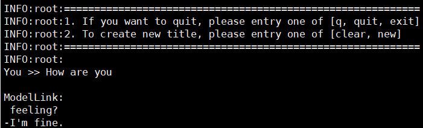
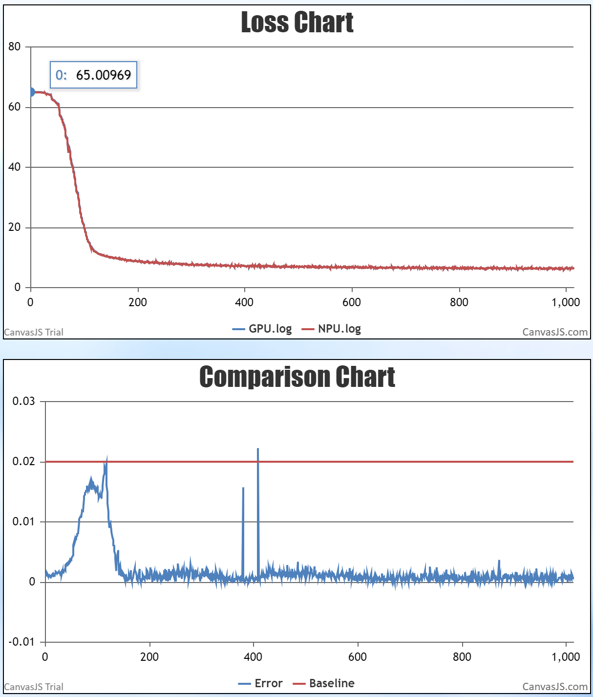

# Bloom
<p align="left">
        <b>简体中文</b> |
        <b><a href="https://gitee.com/ascend/ModelLink/blob/modellink/examples/bloom/README_en.md">English</a> </b> 
    </p>
</p>


#  目录

- [Bloom-7B](#Bloom-7B)
  - [训练](#训练)
    - [脚本](#脚本)
    - [性能](#性能)
        - [吞吐](#吞吐)
        - [精度](#精度)
  - [推理](#推理)
    - [脚本](#脚本)
   [评测](#评测)
    - [脚本](#脚本)
  


# Bloom-7B

## 训练
Bloom-7B 训练的硬件配置如下：

|  硬件 |       配置        |
|:---:|:---------------:|
| NPU | 8 x Ascend NPUs |

### 脚本

1. 拷贝仓库到你的个人服务器：
```shell
git clone https://gitee.com/ascend/ModelLink.git 
cd ModeLlink 
git checkout modellink
mkdir logs
mkdir ckpt
```

2. 搭建环境

```bash
# python3.8
conda create -n test python=3.8
conda activate test

# 安装 torch 和 torch_npu 
pip install torch-2.1.0-cp37-cp37m-linux_aarch64.whl
pip install torch_npu-2.1.0.XXX-cp37-cp37m-linux_aarch64.whl
pip install apex-0.1_ascend*-cp38-cp38m-linux_aarch64.whl

# 修改 ascend-toolkit 路径
source /usr/local/Ascend/ascend-toolkit/set_env.sh

# 安装加速库
git clone https://gitee.com/ascend/AscendSpeed.git
cd AscendSpeed
pip install -r requirements.txt 
pip3 install -e .
cd ..

# 安装其余依赖库
pip install -r requirements.txt 
```

3.准备预训练权重

首先下载 Bloom-7B 的 [权重](https://huggingface.co/bigscience/bloom-7b1/tree/main)

```shell
mkdir tokenizer
cd tokenizer
wget https://huggingface.co/bigscience/bloom/resolve/main/special_tokens_map.json
wget https://huggingface.co/bigscience/bloom/resolve/main/tokenizer.json
wget https://huggingface.co/bigscience/bloom/resolve/main/tokenizer_config.json
...
cd ..
```

接着将hf格式的权重转化为megatron的形式：
```shell
mkdir bloom-7b

SCRIPT_PATH=./tools/ckpt_convert/bloom/convert_weights_from_huggingface.py
python tools/checkpoint/util.py --model-type GPT \
                                --loader bloom-7b \
                                --saver megatron \
                                --target-tensor-parallel-size 8 \
                                --load-dir ../bloom-7b-hf \
                                --save-dir bloom-7b \
                                --tokenizer-model ../bloom-7b-hf/tokenizer.model
```

4. 准备数据集

下载 Bloom-7B 的 [enwiki数据集](https://huggingface.co/datasets/teven/enwiki_100k).
```shell
# 下载数据集
mkdir enwiki_100k_datasets
cd enwiki_100k_datasets
wget https://huggingface.co/datasets/teven/enwiki_100k/resolve/main/data/train-00000-of-00006-67bcc7d401923db0.parquet
wget https://huggingface.co/datasets/teven/enwiki_100k/resolve/main/data/train-00001-of-00006-6b8562cbb05789a4.parquet
wget https://huggingface.co/datasets/teven/enwiki_100k/resolve/main/data/train-00002-of-00006-62d2b426a93b0912.parquet
wget https://huggingface.co/datasets/teven/enwiki_100k/resolve/main/data/train-00003-of-00006-36c3d6da04c724b6.parquet
wget https://huggingface.co/datasets/teven/enwiki_100k/resolve/main/data/train-00004-of-00006-48bdf99256dcfa5d.parquet
wget https://huggingface.co/datasets/teven/enwiki_100k/resolve/main/data/train-00005-of-00006-bcb3b3af8d7a4140.parquet
cd ..

# 预处理数据
python ./tools/preprocess_data.py \
  --input ./enwiki_100k_datasets/ \
  --tokenizer-name-or-path ./tokenizer \
  --output-prefix ./enwiki_100k_datasets/enwiki-100k \
  --worker 4 \
  --log-interval 1000 \
  --tokenizer-type PretrainedFromHF
```


5. 配置 Bloom-7B 预训练脚本: examples/bloom/pretrain_bloom_ptd_7B.sh 

```shell
# 修改 ascend-toolkit 路径
source /usr/local/Ascend/ascend-toolkit/set_env.sh 

CKPT_SAVE_DIR="./ckpt"
DATA_PATH="./dataset_bloom-7B/bigscience_bloom-7b1_master_text_document"
TOKENIZER_PATH="./bloom-7B-hf/"
CKPT_LOAD_DIR="./bloom-7b"
```

6. 启动 Bloom-7B 预训练脚本: examples/bloom/pretrain_bloom_ptd_7B.sh 

```shell
bash examples/bloom/pretrain_bloom_ptd_7B.sh 
```

### 性能

#### 吞吐
Bloom-7B

|  设备  |    模型     | 迭代数  | 样本吞吐 (samples/s) | tokens吞吐 (tokens/s/p) | 单步迭代时间 (s/step) | 
|:----:|:---------:|:----:|:---------------------:|:---------------:|:----------------:|
| NPUs | Bloom 7b | 1000 | 7.95 | 2034 | 64.55
|  参考  | Bloom 7B | 1000 | 9.894 |  2525 | 19.40 

#### 精度

NPU与参考精度比对：


NPU VS Reference 相对误差


## Bloom-7B推理
首先配置Bloom-7B 推理脚本: tasks/inference/generate_bloom_ptd_7B.sh 
```bash
# 根据您自己的 ascend-toolkit 路径，执行set_env.sh
source /usr/local/Ascend/ascend-toolkit/set_env.sh 
 
# 修改模型权重路径和词表路径
CHECKPOINT="your model save ckpt path"
TOKENIZER_PATH="your tokenizer path"
```

然后可直接启动generate_bloom_7b_ptd.sh

```bash
bash tasks/inference/generate_bloom_7b_ptd.sh
```
推理示例如下：


## Bloom-7B评测

配置Bloom-7B 评估脚本: tasks/evaluation/evaluate_bloom_7b_ptd.sh

```bash
# ascend-toolkit 路径
source /usr/local/Ascend/ascend-toolkit/set_env.sh 

# 修改模型参数路径和词表路径
CHECKPOINT="your model save ckpt path"
TOKENIZER_PATH="your tokenizer path"
# 配置任务和数据集路径
DATA_PATH="your dataset path"
TASK="your task"
```

启动评估

```bash
bash tasks/evaluation/evaluate_bloom_7B_ptd.sh
```
MMLU评测得分

|  数据集 |验证集  |参考准确率|NPU准确率|
|:---:|:---:|:---:|:---:|
| mmlu | test |0.254|0.251|


# Bloom-176B

## 训练

BLOOM 模型源于: [A 176B-Parameter Open-Access Multilingual Language Model](https://arxiv.org/abs/2211.05100).

> Scao, Teven Le, et al. "Bloom: A 176b-parameter open-access multilingual language model." arXiv preprint arXiv:2211.05100 (2022).

Bloom-176B 训练的硬件配置:

| **硬件** | **配置**          |
|--------|-----------------|
| NPU    | 12x8 Ascend 910 | 

## 脚本

1. 将仓库拉取到个人服务器

```shell
git clone https://gitee.com/ascend/AscendSpeed.git
cd AscendSpeed
```

2. 搭建环境

```shell
# python3.8
conda create -n bloom176b python=3.8
conda activate bloom176b

# 安装 torch 和 torch_npu
pip install torch-2.0.1-cp38-cp38-manylinux2014_aarch64.whl
pip install torch_npu-2.0.1rc1.postxxxxxxxx-cp38-cp38-linux_aarch64.whl
pip install apex-0.1_ascend_xxxxxxxx-cp38-cp38-linux_aarch64.whl

# 安装 megatron-core
pip3 install --no-use-pep517 -e git+https://github.com/NVIDIA/Megatron-LM.git@23.05#egg=megatron-core

# 安装 deepspeed 和 deepspeed_npu
pip install deepspeed==0.9.2
git clone https://gitee.com/ascend/DeepSpeed.git -b v0.9.2 deepspeed_npu
cd deepspeed_npu
pip3 install -e ./
cd ..

# 安装其余依赖
pip install -r requirements.txt
```

3. 准备预训练权重

下载 Bloom-176B [权重](https://huggingface.co/bigscience/bloom/tree/main)

```shell
mkdir tokenizer
cd tokenizer
wget https://huggingface.co/bigscience/bloom/resolve/main/special_tokens_map.json
wget https://huggingface.co/bigscience/bloom/resolve/main/tokenizer.json
wget https://huggingface.co/bigscience/bloom/resolve/main/tokenizer_config.json
...
cd ..
```

将权重格式从 huggingface 格式转换为 AscendSpeed 格式：

```shell
#!/bin/bash

SCRIPT_PATH=./tools/ckpt_convert/bloom/convert_weights_from_huggingface.py
python $SCRIPT_PATH \
    --input-model-dir "your huggingface checkpoint path" \
    --output-model-dir "your ascendspeed checkpoint path" \
    --tensor-model-parallel-size 8 \
    --pipeline-model-parallel-size 12 \
    --type 176B \
    --deepspeed \
    --partition-layers 6,6,6,6,6,6,6,6,6,6,6,4
# partition-layers 指定的是PP当中每个stage的层数，总和需要等于70
```
4. 准备数据集

下载 Bloom-176B 的 [数据集](https://huggingface.co/datasets/teven/enwiki_100k). 

```shell
# 下载数据集
mkdir enwiki_100k_datasets
cd enwiki_100k_datasets
wget https://huggingface.co/datasets/teven/enwiki_100k/resolve/main/data/train-00000-of-00006-67bcc7d401923db0.parquet
wget https://huggingface.co/datasets/teven/enwiki_100k/resolve/main/data/train-00001-of-00006-6b8562cbb05789a4.parquet
wget https://huggingface.co/datasets/teven/enwiki_100k/resolve/main/data/train-00002-of-00006-62d2b426a93b0912.parquet
wget https://huggingface.co/datasets/teven/enwiki_100k/resolve/main/data/train-00003-of-00006-36c3d6da04c724b6.parquet
wget https://huggingface.co/datasets/teven/enwiki_100k/resolve/main/data/train-00004-of-00006-48bdf99256dcfa5d.parquet
wget https://huggingface.co/datasets/teven/enwiki_100k/resolve/main/data/train-00005-of-00006-bcb3b3af8d7a4140.parquet
cd ..

# 处理数据集
python ./tools/preprocess_data.py \
  --input ./enwiki_100k_datasets/ \
  --tokenizer-name-or-path ./tokenizer \
  --output-prefix ./enwiki_100k_datasets/enwiki-100k \
  --worker 4 \
  --log-interval 1000 \
  --tokenizer-type PretrainedFromHF
```

5. 配置 Bloom-176B 预训练脚本: examples/bloom/pretrain_bloom_176b.sh

```shell
# 修改 MASTER_ADDR 为主节点 IP，比如, 90.90.2.166
MASTER_ADDR=localhost

# 修改每个节点的节点序号，主节点序号为 0, 其余节点的序号依次增长到集群节点数量-1
NODE_RANK=0

# 修改数据集路径和词表路径
TOKENIZER_NAME_OR_PATH=/home/bloom_data/vocab_file/
DATA_PATH=/home/bloom_data/enwiki_100k/enwiki-100k_text_document
```

6. 启动 Bloom-176B 预训练脚本: examples/bloom/pretrain_bloom_176b.sh

在集群中的每个节点上启动 examples/bloom/pretrain_bloom_176b.sh 脚本

```shell
bash examples/bloom/pretrain_bloom_176b.sh
```

```text
当要开启FA时，在脚本中添加`--use-flash-attn`与`--square-alibi-mask`来使能，同时不要使用`--is-instruction-dataset`.
```

## 性能

### 吞吐

Bloom-176B 在 **昇腾芯片** 和 **参考芯片** 上的性能对比:

| 设备 | 模型         | 总迭代数 | tokens吞吐 (tokens/p/s) |
|----|------------|------|-----------------------|
| NPUs | Bloom-176B | 1000 | 108                   |
| 参考 | Bloom-176B | NA   | 107                   |

### 精度

NPU vs 参考 loss 


单节点loss对比



## 推理

AscendSpeed 支持 BLOOM 176B的在线文本生成推理
We support AscendSpeed Inference for text generation with BLOOM 176B (deepspeed or megatron).

### deepspeed_pipeline
```text
    # 请注意，评估时需要修改一个deepspeed的bug：
    # 将 `<deepspeed-installed-path>/runtime/pipe/engine.py` 文件里的第671行注释掉：
    # self.total_loss += self.loss.detach()
```
```shell
# # 修改 model weight 路径和 tokenizer 路径
CHECKPOINT=/home/model/bloom_176B
VOCAB_FILE=/home/bloom_data/vocab_file/
```

```shell
bash ./examples/bloom/generate_bloom_176b_deepspeed_pipeline.sh
```

### megatron

使用 [convert_weights_from_gptmodelpipe_to_gptmodel.sh](../../tools/ckpt_convert/bloom/convert_weights_from_gptmodelpipe_to_gptmodel.sh) 脚本将权重转化为推理格式。
推理需要两节点运行，需要我们手工将权重同步到两节点下，0号节点需要 1-37 层权重，1号节点需要 38-74 层权重，执行脚本如下：
```bash
SCRIPT_PATH=./tools/ckpt_convert/bloom/convert_weights_from_gptmodelpipe_to_gptmodel_v2.py
python $SCRIPT_PATH \
    --input-model-dir ${INPUT_PATH} \
    --output-model-dir ${OUTPUT_PATH} \
    --tensor-model-parallel-size 8 \
    --pipeline-model-parallel-size 2 \
    --type 176B
```
### 脚本

配置 Bloom-176B 推理脚本: examples/bloom/generate_bloom_176b_2nodes.sh

```shell
# 修改 MASTER_ADDR 为主节点 IP，比如, 90.90.2.166
MASTER_ADDR=localhost

# 修改每个节点的节点序号，主节点序号为 0, 其余节点的序号依次增长到集群节点数量-1
NODE_RANK=0

# 修改数据集路径和词表路径
CHECKPOINT=/home/model/bloom_176B
VOCAB_FILE=/home/bloom_data/vocab_file/
```

```shell
bash ./examples/bloom/generate_bloom_176b_2nodes.sh
```


## 评估 

配置 Bloom-176B 评估脚本: tasks/evaluation/evaluate_bloom_176b.sh

```shell
# 修改 model weight 路径和 tokenizer 路径和数据集任务路径
CHECKPOINT=/home/model/bloom_176B
VOCAB_FILE=/home/bloom_data/vocab_file/
DATA_PATH="/dataset/boolq/test"
TASK="boolq"
```

```text
    # 请注意，评估时需要修改一个deepspeed的bug：
    # 将 `<deepspeed-installed-path>/runtime/pipe/engine.py` 文件里的第671行注释掉：
    # self.total_loss += self.loss.detach()
```

```shell
bash tasks/evaluation/evaluate_bloom_176b.sh
```
<table>
  <thead>
    <tr>
      <th>任务</th>
      <th>验证集</th>
      <th>模型</th>
      <th>昇腾值</th>
      <th>社区值</th>
    </tr>
  </thead>
  <tbody>
    <tr>
      <td><a href="https://huggingface.co/datasets/boolq">Boolq</a></td>
      <td>Test</td>
      <th>bloom 176b</th>
      <td>0.657</td>
      <td>--</td>
    </tr>
  </tbody>
</table>

# 举例
1. bloom 7b


2. bloom 176b

