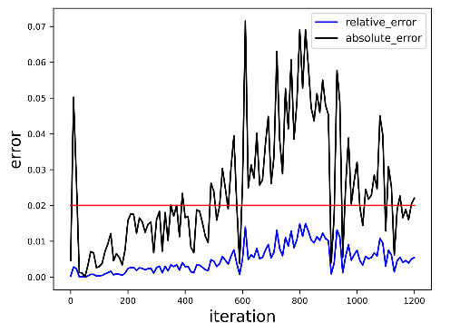

# text generation using bloom

`bash examples/bloom_task/generate_text_bloom.sh`

> We generate text samples using largely the Bloom pretraining script. Few changes need to make, such as we need to provide the path to the pretrained checkpoint, the length of the output samples.

```shell
DISTRIBUTED_ARGS="--nproc_per_node 8 --nnodes 1 --node_rank 0 --master_addr localhost --master_port 6001"

CHECK_POINTS=<checkpoints-path>
TOKENIZER_NAME_OR_PATH=<tokenizer-vocab-file-path>

python -m torch.distributed.run $DISTRIBUTED_ARGS ./examples/bloom_task/generate_text_bloom.py \
               --load $CHECK_POINTS \
               --tokenizer-type PretrainedFromHF \
               --tokenizer-name-or-path $TOKENIZER_NAME_OR_PATH  \
               --tensor-model-parallel-size 8 \
               --pipeline-model-parallel-size 1 \
               --embed-layernorm \
               --position-embedding-type alibi \
               --num-layers 30 \
               --hidden-size 4096 \
               --attention-dropout 0 \
               --hidden-dropout 0 \
               --num-attention-heads 32 \
               --micro-batch-size 1 \
               --seq-length 2048 \
               --max-position-embeddings 2048 \
               --init-method-std 0.0048 \
               --log-interval 1 \
               --layernorm-epsilon 1e-6 \
               --fp16 \
               --no-load-optim \
               --no-load-rng \
               --out-seq-length 1024 \
               --temperature 1.0 \
               --top_p 0.9 \
               --recompute \
```

# bloom 7b 1000 step perftest

**NPU loss**


**NPU GPU loss relative error**

