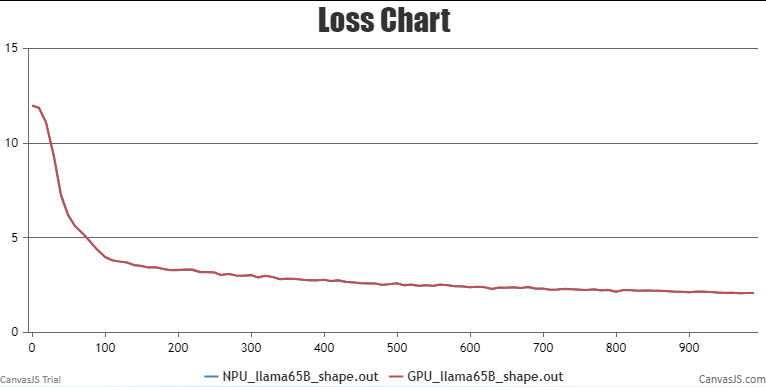
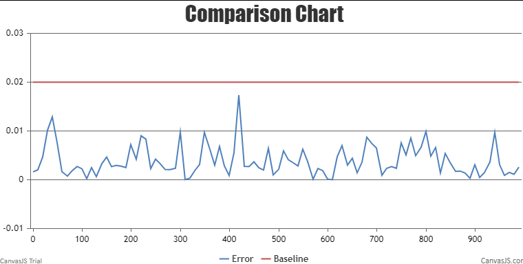

# LLaMA-65B

This directory contains some of the scripts that were used to produce the results in the AscendSpeed. These scripts is to show the example how to run llama_65B in terminal.

LLaMA model is from: [LLaMA: OPen and Efficient Foundation Language Models](https://arxiv.org/pdf/2302.13971v1.pdf)

>Touvron, Hugo, et al. "LLaMA: OPen and Efficient Foundation Language Models." arXiv preprint arXiv:2302.13971 (2023).

# Contents

- [Contents](#contents)

- [Pre-Training](#pre-training)
  - [Datasets](#datasets)
  
  - [Script](#script)
  
  - [Performance](#performance)
  	- [Machine performance](#machine-performance)
  	- [Accuracy of the loss](#accuracy-of-the-loss)
  
- [Citation](#citation)


## Pre-Training

LLaMA's model performace is better than GPT3 with less parameters. The 65B LLaMA model is comparable to Google's Chinchilla-70B and Palm-540B.

Here's a quick summary of training llama:
|              |                         |
| :----------: | :---------------------: |
|   Hardware   | 96 64GB Altas 910B NPUs |
|   Software   |       AscendSpeed       |
| Architecture |     GPT3 w/ extras      |
|   Dataset    |       See datasets      |

### Datasets
The model was trained using the following source of data: CCNet[67%], C4[15%], GitHub[4.5%], Wikipedia[4.5%], Books[4.5%], ArXiv[2.5%], Stack Exchange[2%]. The Wikipedia and Books domains include data in the following languages: bg, ca, cs, da, de, en, es, fr, hr, it, nl, pl, pt, ro, ru, sl, sr, sv, uk. See the paper for more details about the training set and corresponding preprocessing.

### Script

1.Install AscendSpeed requirement environment.

2.Download dataset:https://www.huggingface.co/decapoda-research/llama-30b-hf

3.Config llama-65B pre-training script : AscendSpeed/examples/llama/pretrain_llama_65B_ptd_32p.sh

```bash
# modify the script according to your own conda and ascend-toolkit path
export LD_LIBRARY_PATH=/usr/local/lib:/usr/local/lib:/root/miniconda3/lib:$LD_LIBRARY_PATH
export HEEL_CONNECT_TIMEOUT=1200
export COMBINED_ENABLE=1

# modify script orign dataset path according to your own dataset path
TOKENIZER_PATH=./dataset/llama_tokenizer # line 16
DATA_PATH=./dataset/llama_text_document # line 17

```

4.Launch llama-65B pre-training script : AscendSpeed/examples/llama/pretrain_llama_65B_ptd_32p.sh

```bash
bash examples/llama/pretrain_llama_65B_ptd_32p.sh
```

There is an hourly pulse checking script running that checks that the training is either running or scheduled.

The Training log will look like these:

```Shell
 iteration  3/50000 | consumed samples: 768 | consumed tokens:  1572864 | elapsed time per iteration (ms):  33818.0 | learning rate:    1.406E-07 | gloabl batch size:  256 | lm loss:  1.200820E+01 | loss scale:  1.0 | grad norm:    9.216 | actual seqlen:  2048 | number of skipped
iterations: 0 | number of nan iterations:   0 | samples per second: 7.570 | TFLOPs: 107.09 |
time (ms)
```

### Performance

#### Machine performance

The performance of the NPUs in **Ascend910 B1 64GB** and GPUs is **A100**:

|  Device  |   Model   | total Iterations | throughput rate (samples/s/p) | throughput rate (tokens/s/p) | single-step time (s/step) | floating point operation (TFLOPs/s) |
| :------: | :-------: | :--------------: | :---------------------------: | :--------------------------: | :-----------------------: | :---------------------------------: |
|   GPUs   | llama_65B |     50000        |             1.23              |           2540.23            |           19.44           |                5.68                 |
|   NPUs   | llama_65B |     50000        |             1.26              |           2588.03            |           19.07           |                5.91                 |

Notes: 

- LLaMA-65B model is trained on a single machine with 8 NPUs

Here's a hardware summary of pre-training llama_65B:

| Hardware |                      Value                      |
| :------: | :---------------------------------------------: |
|   CPU    | 4xKunPeng920@3.0GHz，64 Core Pre Socket 256CPUS |
|   RAM    |                  32x32 GB DDR4                  |
|   NPU    |               8 x Ascend910B1 64G               |

Here's a software summary of pre-training llama_65B:

|         Software          |                 Version                 |
| :-----------------------: | :-------------------------------------: |
|            OS             |            Euler OS v2(SP10)            |
|           uname           |                 aarch64                 |
|          Python           |                  3.7.9                  |
|          driver           |                23.0.RC2                 |
|         firmware          |                23.0.RC2                 |
|           CANN            |                 7.0.RC2                 |
| binary arithmetic package | Ascend-ccann-kernels-910b_6.3.RC2_linux |
|           torch           |                 1.11.0                  |
|         torch_npu         |           1.11.0.dev20230713            |
|         deepspeed         |                  0.9.2                  |
|       deepspeed-npu       |                   0.1                   |
|        Ascendspeed        |                2023-9-28                |


#### Accuracy of the loss

NPU vs GPU loss.

The NPU runs smoothly, the resource usage is stable, no errors are reported in the middle of the process, the Loss is on a decreasing trend, and the convergence speed is as expected.



NPU vs GPU loss relative error.

The relative error between NPU and GPU Loss is less than 0.02 throughout, as expected.



## Citation

You may also consider original work in your reference:

@article{Touvron2023llama,
  title={LLaMA: OPen and Efficient Foundation Language Models},
  author={Hugo Touvron*, Thibaut Lavril*, Gautier Izacard*, Xavier Martinet, Marie-Anne Lachaux, Timothee Lacroix, Baptiste Roziere, Naman Goyal,
  Eric Hambro, Faisal Azhar, Aurelien Rodriguez, Armand Joulin, Edouard Grave*, Guillaume Lample*},
  journal={arXiv preprint arXiv:2302.13971},
  year={2023}
}