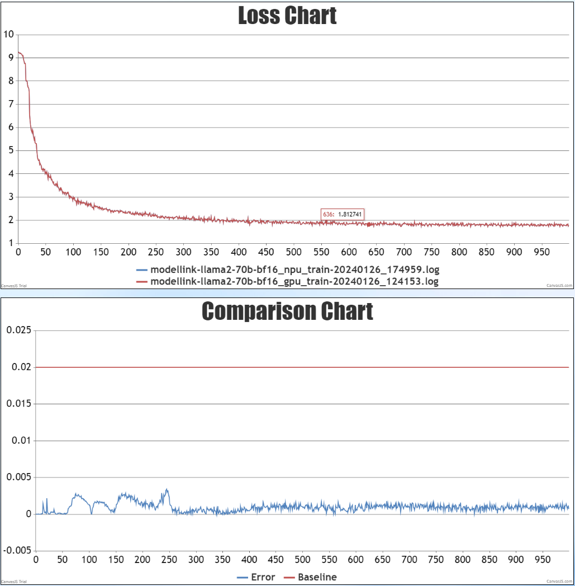
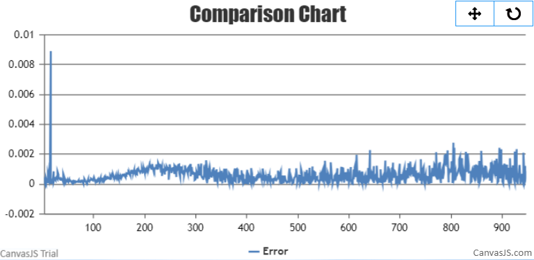

# LLaMA2

<p align="left">
        <b>简体中文</b> |
        <b><a href="https://gitee.com/ascend/AscendSpeed/blob/master/examples/llama2/README_en.md">English</a> </b> 
    </p>
</p>


#  目录

- [LLaMA2-7B](#LLaMA2-7B)
  - [训练](#训练)
  - [脚本](#脚本)
  - [性能](#性能)
    - [吞吐](#吞吐)
    - [精度](#精度)

- [LLaMA2-70B](#LLaMA2-70B)
  - [训练](#训练)
    - [脚本](#脚本)
    - [性能](#性能)
      - [吞吐](#吞吐)
      - [精度](#精度)
  - [推理](#inference-70b)
  - [评估](#评估)


# LLaMA2-7B

## 训练

LLaMA2-7B 训练的硬件配置:

|  硬件 |       配置        |
|:---:|:---------------:|
| NPU | 8 x Ascend NPUs |

LLaMA2-7B 训练的软件配置: 

|            软件             |                                                      配置                                                      |
|:-------------------------:|:------------------------------------------------------------------------------------------------------------:|
|          python           |                                                    3.7.16                                                    |
|          driver           | [package](https://support.huawei.com/enterprise/zh/ascend-computing/atlas-900-pod-a2-pid-254184911/software) |
|         firmware          | [package](https://support.huawei.com/enterprise/zh/ascend-computing/atlas-900-pod-a2-pid-254184911/software) |
|           CANN            |       [package](https://support.huawei.com/enterprise/zh/ascend-computing/cann-pid-251168373/software)       |
| binary arithmetic package |       [package](https://support.huawei.com/enterprise/zh/ascend-computing/cann-pid-251168373/software)       |
|           torch           |                                                    1.11.0                                                    |
|         torch_npu         |                             [package](https://gitee.com/ascend/pytorch/releases)                             |

### 脚本

1. 拷贝代码仓到本地服务器
    ```shell
    git clone https://gitee.com/ascend/AscendSpeed.git
    cd AscendSpeed 
    mkdir logs
    mkdir ckpt
    ```

2. 搭建环境
    
    ```bash
    # python3.7
    conda create -n test python=3.7
    conda activate test
    
    # 安装 torch 和 torch_npu
    pip install torch-1.11.0-cp37-cp37m-manylinux2014_aarch64.whl
    pip install torch_npu-1.11.0*-cp37-cp37m-linux_aarch64.whl
    pip install apex-0.1_ascend*-cp37-cp37m-linux_aarch64.whl
    
    # 安装 megatron-core
    pip3 install --no-use-pep517 -e git+https://github.com/NVIDIA/Megatron-LM.git@23.05#egg=megatron-core
    
    # 安装 deepspeed 和 deepspeed_npu
    pip install deepspeed==0.9.2
    git clone https://gitee.com/ascend/DeepSpeed.git -b v0.9.2 deepspeed_npu
    cd deepspeed_npu
    pip3 install -e ./
    cd ..
    
    # install other packages
    pip install -r requirements.txt 
    ```

3. 下载 LLaMA2-7B 的 [预训练权重和词表](https://huggingface.co/daryl149/llama-2-7b-hf/tree/main) 
    
    ```shell
      #!/bin/bash
      mkdir -p llama-2-7b-hf
      cd llama-2-7b-hf
      wget https://huggingface.co/daryl149/llama-2-7b-hf/resolve/main/config.json
      wget https://huggingface.co/daryl149/llama-2-7b-hf/resolve/main/generation_config.json
      wget https://huggingface.co/daryl149/llama-2-7b-hf/resolve/main/pytorch_model-00001-of-00002.bin
      wget https://huggingface.co/daryl149/llama-2-7b-hf/resolve/main/pytorch_model-00002-of-00002.bin
      wget https://huggingface.co/daryl149/llama-2-7b-hf/resolve/main/pytorch_model.bin.index.json
      wget https://huggingface.co/daryl149/llama-2-7b-hf/resolve/main/special_tokens_map.json
      wget https://huggingface.co/daryl149/llama-2-7b-hf/resolve/main/tokenizer.json
      wget https://huggingface.co/daryl149/llama-2-7b-hf/resolve/main/tokenizer.model
      wget https://huggingface.co/daryl149/llama-2-7b-hf/resolve/main/tokenizer_config.json
      cd ..
    ```

    ```text
    # 请注意，如果要加载huggingface的预训练权重，需要修改一个deepspeed关于加载权重的bug：
    # 在 `<deepspeed-installed-path>/runtime/engine.py` 文件里的 `_load_zero_checkpoint` 函数，
    # 将 `if zero_sd_list is None` 改为 `if zero_sd_list is None or len(zero_sd_list) == 0`
    
    # 原始 deepspeed/runtime/engine.py, 大概 #Lines2746-2748
    zero_sd_list = self._get_all_zero_checkpoints(load_dir, tag)
    if zero_sd_list is None:
        return False
    
    # 修改后
    zero_sd_list = self._get_all_zero_checkpoints(load_dir, tag)
    if zero_sd_list is None or len(zero_sd_list) == 0:
        return False
    ```

    将权重从 huggingface 格式转化为 AscendSpeed 格式
    ```bash
    # 修改 ascend-toolkit 路径
    source /usr/local/Ascend/ascend-toolkit/set_env.sh
    
    # 权重格式转换
    python tools/ckpt_convert/llama/convert_weights_from_huggingface.py --input-model-dir llama-2-7b-hf \
                                                                        --output-model-dir ckpt \
                                                                        --tensor-model-parallel-size 1 \
                                                                        --pipeline-model-parallel-size 1 \
                                                                        --type 7B \
                                                                        --deepspeed
    ```

4. 准备数据集
    
    下载 LLaMA2-7B [数据集](https://huggingface.co/datasets/tatsu-lab/alpaca/resolve/main/data/train-00000-of-00001-a09b74b3ef9c3b56.parquet) 
        
    ```shell
      # 下载数据
      mkdir dataset_llama2
      cd ./dataset_llama2
      wget https://huggingface.co/datasets/tatsu-lab/alpaca/resolve/main/data/train-00000-of-00001-a09b74b3ef9c3b56.parquet
      cd ..
    
      # 处理数据                             
      python ./tools/preprocess_data.py \
        --input ./dataset_llama2/train-00000-of-00001-a09b74b3ef9c3b56.parquet \
        --tokenizer-name-or-path ./llama-2-7b-hf \
        --output-prefix ./dataset_llama2/alpaca \
        --workers 4 \
        --log-interval 1000 \
        --tokenizer-type PretrainedFromHF
    ```

5. 配置 LLaMA2-7B 预训练脚本: examples/llama2/pretrain_llama2_7b_zero_8p.sh
    
    ```shell
    # 设置 ascend-toolkit 路径
    source /usr/local/Ascend/ascend-toolkit/set_env.sh 
    
    # 配置词表，数据集等路径
    TOKENIZER_PATH=./llama-2-7b-hf/  #词表路径
    DATA_PATH=./dataset_llama2/alpaca_text_document  #数据集路径
    ```

6. 启动 LLaMA2-7B 预训练脚本: examples/llama2/pretrain_llama2_7b_zero_8p.sh
    
    ```shell
    bash examples/llama2/pretrain_llama2_7b_zero_8p.sh 
    ```

### 性能

#### 吞吐

LLaMA2-7B 在 **昇腾芯片** 和 **参考芯片** 上的性能对比：

|  设备  |    模型     | 迭代数  | 样本吞吐 (samples/p/s) | tokens吞吐 (tokens/s/p) | 单步迭代时间 (s/step) | 浮点计算数 (TFLOPs/s) |
|:----:|:---------:|:----:|:------------------:|:---------------------:|:---------------:|:----------------:|
| NPUs | LLaMA2-7B | 1024 |       4.804        |       2459.648        |      6.66       |      147.42      |
|  参考  | LLaMA2-7B | 1024 |       4.585        |        2347.63        |      6.99       |      143.01      |


#### 精度

NPU vs 参考 loss


相对误差


绝对误差


# LLaMA2-70B

## 训练

LLaMA2-70B 训练的硬件配置:

| 硬件  |        配置        |
|:---:|:----------------:|
| NPU | 64 x Ascend NPUs |

LLaMA2-70B 训练的软件配置:

|            软件             |                   版本                    |                                                                                       链接                                                                                        |
|:-------------------------:|:---------------------------------------:|:-------------------------------------------------------------------------------------------------------------------------------------------------------------------------------:|
|          python           |                  3.8.0                  |                                                                                        -                                                                                        |
|          driver           |              23.0.RC3.B050              | [link](https://support.huawei.com/enterprise/zh/ascend-computing/ascend-hdk-pid-252764743/software/261159045?idAbsPath=fixnode01%7C23710424%7C251366513%7C22892968%7C252764743) |
|         firmware          |              7.0.t8.0.b214              | [link](https://support.huawei.com/enterprise/zh/ascend-computing/ascend-hdk-pid-252764743/software/261159045?idAbsPath=fixnode01%7C23710424%7C251366513%7C22892968%7C252764743) |
|           CANN            |   Ascend-cann-toolkit-7.0.0.T26-linux   |                                                [link](https://support.huawei.com/enterprise/zh/software/261305471-ESW2000887514)                                                |
| binary arithmetic package | Ascend-cann-kernels-XXX_7.0.0.T26_linux |                                                [link](https://support.huawei.com/enterprise/zh/software/261305471-ESW2000887523)                                                |
|           torch           |                  2.0.1                  |                                                   [link](https://gitee.com/ascend/pytorch/releases/tag/v5.0.rc3-pytorch2.0.1)                                                   |
|         torch_npu         |          2.0.1.post4-20231010           |                          [link](https://gitee.com/ascend/pytorch/releases/download/v5.0.rc3-pytorch2.0.1/torch_npu-2.0.1-cp38-cp38-linux_aarch64.whl)                           |
|           apex            |                   0.1                   |                                                                                        -                                                                                        |


### 脚本

1. 拷贝仓库到本地服务器:
    ```shell
    git clone https://gitee.com/ascend/AscendSpeed.git 
    cd AscendSpeed 
    mkdir logs
    mkdir ckpt
    ```

2. 搭建环境
    
    ```bash
    # python3.8
    conda create -n test python=3.8
    conda activate test
    
    # 按照 torch 和 torch_npu
    pip install torch-2.0.1-cp38-cp38m-manylinux2014_aarch64.whl
    pip install torch_npu-2.0.1-cp38-cp38m-linux_aarch64.whl
    pip install apex-0.1_ascend*-cp38-cp38m-linux_aarch64.whl
    
    # 安装 megatron-core
    pip3 install --no-use-pep517 -e git+https://github.com/NVIDIA/Megatron-LM.git@23.05#egg=megatron-core
    
    # 安装 deepspeed 和 deepspeed_npu
    pip install deepspeed==0.9.2
    git clone https://gitee.com/ascend/DeepSpeed.git -b v0.9.2 deepspeed_npu
    cd deepspeed_npu
    pip3 install -e ./
    cd ..
    
    # 安装其余依赖包
    pip install -r requirements.txt 
    ```

3. 准备[预训练权重和词表](https://huggingface.co/meta-llama/Llama-2-70b-hf)

    ```shell
      #!/bin/bash
      mkdir -p llama2-70b-hf
      cd llama2-70b-hf
      wget https://huggingface.co/meta-llama/Llama-2-70b-hf/blob/main/config.json
      wget https://huggingface.co/meta-llama/Llama-2-70b-hf/blob/main/generation_config.json
      wget https://huggingface.co/meta-llama/Llama-2-70b-hf/blob/main/pytorch_model-00001-of-00015.bin
      wget https://huggingface.co/meta-llama/Llama-2-70b-hf/blob/main/pytorch_model-00002-of-00015.bin
      wget https://huggingface.co/meta-llama/Llama-2-70b-hf/blob/main/pytorch_model-00003-of-00015.bin
      wget https://huggingface.co/meta-llama/Llama-2-70b-hf/blob/main/pytorch_model-00004-of-00015.bin
      wget https://huggingface.co/meta-llama/Llama-2-70b-hf/blob/main/pytorch_model-00005-of-00015.bin
      wget https://huggingface.co/meta-llama/Llama-2-70b-hf/blob/main/pytorch_model-00006-of-00015.bin
      wget https://huggingface.co/meta-llama/Llama-2-70b-hf/blob/main/pytorch_model-00007-of-00015.bin   
      wget https://huggingface.co/meta-llama/Llama-2-70b-hf/blob/main/pytorch_model-00008-of-00015.bin
      wget https://huggingface.co/meta-llama/Llama-2-70b-hf/blob/main/pytorch_model-00009-of-00015.bin
      wget https://huggingface.co/meta-llama/Llama-2-70b-hf/blob/main/pytorch_model-00010-of-00015.bin
      wget https://huggingface.co/meta-llama/Llama-2-70b-hf/blob/main/pytorch_model-00011-of-00015.bin
      wget https://huggingface.co/meta-llama/Llama-2-70b-hf/blob/main/pytorch_model-00012-of-00015.bin   
      wget https://huggingface.co/meta-llama/Llama-2-70b-hf/blob/main/pytorch_model-00013-of-00015.bin
      wget https://huggingface.co/meta-llama/Llama-2-70b-hf/blob/main/pytorch_model-00014-of-00015.bin
      wget https://huggingface.co/meta-llama/Llama-2-70b-hf/blob/main/pytorch_model-00015-of-00015.bin   
      wget https://huggingface.co/meta-llama/Llama-2-70b-hf/blob/main/pytorch_model.bin.index.json
      wget https://huggingface.co/meta-llama/Llama-2-70b-hf/blob/main/special_tokens_map.json
      wget https://huggingface.co/meta-llama/Llama-2-70b-hf/blob/main/tokenizer.json
      wget https://huggingface.co/meta-llama/Llama-2-70b-hf/blob/main/tokenizer.model
      wget https://huggingface.co/meta-llama/Llama-2-70b-hf/blob/main/tokenizer_config.json
      cd ..
    ```

   将权重从huggingface格式转换为AscendSpeed格式
    ```bash
    # 配置 ascend-toolkit 路径
    source /usr/local/Ascend/ascend-toolkit/set_env.sh
    
    # 权重格式转换
    SCRIPT_PATH=./tools/ckpt_convert/llama/convert_weights_from_huggingface.py
    python $SCRIPT_PATH \
      --input-model-dir ./llama2-70b-hf/ \
      --output-model-dir ./load_ckpt \
      --tensor-model-parallel-size 8 \
      --pipeline-model-parallel-size 8 \
      --make-vocab-size-divisible-by 8 \
      --merge-mlp \
      --type llama2-70B \
      --num_heads 64 \
      --num_kv_heads 8 \
      --hidden_size 8192 \
      --num_layers 80                                                                   
    ```

4. 准备数据集

    有两个数据集可以使用: Alpaca 和 Moss. 

    1. Alpaca 数据集
        
       下载 [Alpaca数据集](https://huggingface.co/datasets/tatsu-lab/alpaca/resolve/main/data/train-00000-of-00001-a09b74b3ef9c3b56.parquet)
    ```shell
      # 下载数据集
      mkdir dataset_llama2
      cd ./dataset_llama2
      wget https://huggingface.co/datasets/tatsu-lab/alpaca/resolve/main/data/train-00000-of-00001-a09b74b3ef9c3b56.parquet
      cd ..
    
      # 处理数据集                              
      python ./tools/preprocess_data.py \
        --input ./dataset_llama2/train-00000-of-00001-a09b74b3ef9c3b56.parquet \
        --tokenizer-name-or-path ./llama-2-70b-hf \
        --output-prefix ./dataset_llama2/alpaca \
        --workers 4 \
        --log-interval 1000 \
        --tokenizer-type PretrainedFromHF
   ```
   
    2. Moss 数据集

       下载 [MOSS数据集](https://huggingface.co/datasets/fnlp/moss-003-sft-data/tree/main) 
        
    ```shell
      # 下载数据集
      mkdir dataset_llama2
      cd ./dataset_llama2
      wget https://huggingface.co/datasets/fnlp/moss-003-sft-data/resolve/main/moss-003-sft-no-tools.jsonl.zip --no-check-certificate
      unzip moss-003-sft-no-tools.jsonl.zip
      cd ..
    
      # 处理数据集                              
      python tools/preprocess_data.py \
        --input ./dataset_llama2/moss-003-sft-no-tools.jsonl \
        --output-prefix ./dataset_llama2/moss \
        --tokenizer-type PretrainedFromHF \
        --tokenizer-name-or-path ./llama2-70b-hf \
        --tokenizer-not-use-fast \
        --handler-name MOSSInstructionHandler
    ```
   
5. Config LLaMA2-70B pre-training script: examples/llama2/pretrain_llama2_70B_ptd.sh
   ```shell
    # 配置 ascend-toolkit 路径
    source /usr/local/Ascend/ascend-toolkit/set_env.sh 
    
    # 配置相关路径
    TOKENIZER_PATH=./llama2-70b-hf/  #词表路径
    DATA_PATH=./dataset_llama2/alpaca_text_document  #数据集路径
    ```      
    
6. 启动 LLaMA2-70B 训练脚本: examples/llama2/pretrain_llama2_70B_ptd.sh
    
    ```shell
    bash examples/llama2/pretrain_llama2_70B_ptd.sh
    ```
   
### 性能

#### 吞吐

LLaMA2-70B 在 **昇腾芯片** 和 **参考芯片** 上的性能对比

|  设备  |     模型     | 迭代数  | 样本吞吐率 (samples/s/p) | token吞吐率 (tokens/s/p) | 单步迭代时间 (s/step) | 浮点计算数 (TFLOPs/s) |
|:----:|:----------:|:----:|:-------------------:|:---------------------:|:---------------:|:----------------:|
| NPUs | LLaMA2-70B | 1000 |        5.46         |          350          |       193       |        -         |
|  参考  | LLaMA2-70B | 1000 |        5.29         |          339          |       214       |        -         |


#### 精度


NPU vs 参考 loss.



相对误差


绝对误差




## 推理


权重转为为单机8卡可以运行的格式

```shell
SCRIPT_PATH=./tools/ckpt_convert/llama/convert_weights_when_tp_pp_change.py
python $SCRIPT_PATH \
  --input-model-dir ./load_ckpt/release \
  --output-model-dir ./ptd_80lt8p1/ \
  --orig-vocab-size 32000 \
  --make-vocab-size-divisible-by 8 \
  --src-tensor-model-parallel-size 8 \
  --src-pipeline-model-parallel-size 8 \
  --tgt-tensor-model-parallel-size 8 \
  --tgt-pipeline-model-parallel-size 1 \
  --merge-mlp \
  --type 70B \
  --num_heads 64 \
  --num_kv_heads 8 \
  --hidden_size 8192 \
  --num_layers 80
```

Llama2-70B 使用8卡进行推理：

```shell
    source /usr/local/Ascend/ascend-toolkit/set_env.sh 
    MASTER_ADDR=localhost
    MASTER_PORT=6001
    NNODES=1
    NODE_RANK=0
    NPUS_PER_NODE=8
    
    DISTRIBUTED_ARGS="--nproc_per_node $NPUS_PER_NODE \
                      --nnodes $NNODES \
                      --node_rank $NODE_RANK \
                      --master_addr $MASTER_ADDR \
                      --master_port $MASTER_PORT"

    CHECKPOINT=./ptd_80lt8p1/
    VOCAB_FILE=./llama2-70b-hf/
    python -m torch.distributed.launch $DISTRIBUTED_ARGS ./tasks/inference/inference_llama.py \
           --no-contiguous-buffers-in-local-ddp \
           --tensor-model-parallel-size 8  \
           --pipeline-model-parallel-size 1  \
           --num-layers 80  \
           --hidden-size 8192  \
           --ffn-hidden-size 28672 \
           --load "${CHECKPOINT}"  \
           --num-attention-heads 64 \
           --position-embedding-type rope \
           --group-query-attention \
           --num-query-groups 8 \
           --max-position-embeddings 4096 \
           --mlp-layer-fusion \
           --pad-vocab-size-to 32000 \
           --tokenizer-type PretrainedFromHF  \
           --tokenizer-name-or-path "$VOCAB_FILE" \
           --tokenizer-not-use-fast \
           --fp16 \
           --micro-batch-size 1 \
           --seq-length 4096 \
           --max-new-tokens 64 \
           --seed 42
```

推理样例：
```
=============== Greedy Search ================

You:
how are you?

AscendSpeed:
I hope you are fine. I am fine too.
I am writing to you because I want to tell you about my holidays.
I went to the seaside with my family. We stayed in a hotel.
We went to the beach every day. I played with my my my my my my my my my..
.
. . 0. .... my I was't' I
==============================================

Elapsed: 60.25s

================ Do Sample =================

You:
how are you?

AscendSpeed:
long time, no hear.
I know! It has been far too long... I'm doing alright though, and yourself?
I've been doing pretty well!
Do you live in the US?
No, actually I'm in Australia... I think it would be fairly difficult to make it there.
Subject: I think.
 there? the time for subject...... Sub subject - subject the
============================================

Elapsed: 34.13s

=============== Beam Search =================

You:
how are you?

AscendSpeed:
I hope you are fine. I am fine too.
I am writing to you because I want to tell you about my holidays.
I went to the seaside with my family. We stayed in a hotel near the beach.
We went to the beach every day. We We We We We
=============================================

Elapsed: 46.29s

======== Beam Search with sampling ==========

You:
how are you?

AscendSpeed:
I hope you are fine.
I would like to tell you that I have a problem with my account.
I have a problem with my account.
I have a problem with my account. I can't log in.
I have a problem with my account. I can't log in.

=============================================

Elapsed: 48.53s
```

## 评估

MMLU评估举例，数据集[here](https://huggingface.co/datasets/cais/mmlu)下载

```shell
    CHECKPOINT=./ptd_80lt8p1/
    VOCAB_FILE=./llama2-70b-hf/
    # 配置任务和数据集路径
    DATA_PATH="./mmlu/data/test/"
    TASK="mmlu"
    # configure generation parameters 
    python -m torch.distributed.launch $DISTRIBUTED_ARGS evaluation.py   \
           --task-data-path $DATA_PATH \
           --task $TASK\
           --seq-length 2048 \
           --max-new-tokens 32 \
           --max-position-embeddings 2048 \
           --tensor-model-parallel-size 8  \
           --pipeline-model-parallel-size 1  \
           --num-layers 80  \
           --hidden-size 8192  \
           --ffn-hidden-size 28672 \
           --load ${CHECKPOINT}  \
           --num-attention-heads 64 \
           --position-embedding-type rope \
           --group-query-attention \
           --num-query-groups 8 \
           --tokenizer-type PretrainedFromHF  \
           --tokenizer-name-or-path $VOCAB_FILE \
           --tokenizer-not-use-fast \
           --fp16  \
           --micro-batch-size 1  \
           --seed 42 | tee logs/train.log
    # 开启评估
    bash tasks/evaluation/eval.sh
```