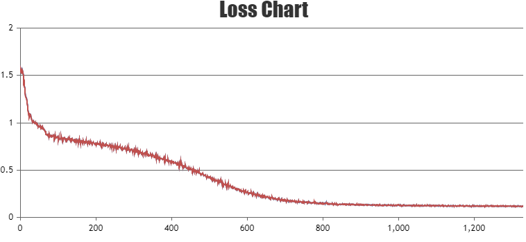
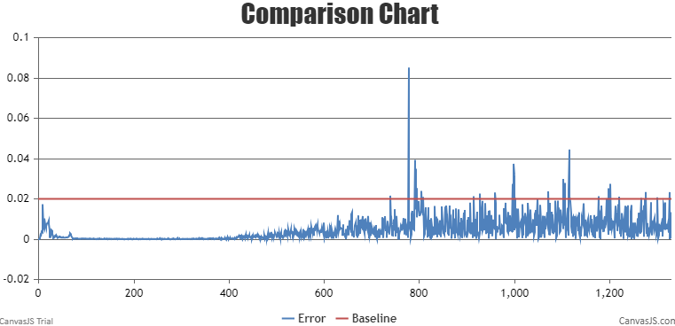
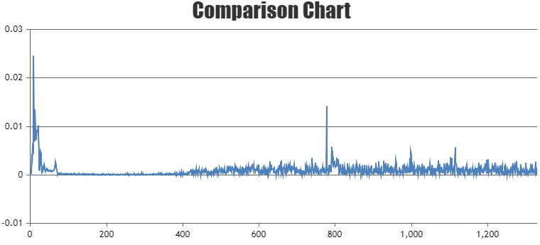

# LLaMA2

<p align="left">
        <b>简体中文</b> |
        <b><a href="https://gitee.com/ascend/AscendSpeed/blob/master/examples/llama2/README_en.md">English</a> </b> 
    </p>
</p>

# 目录

- [LLaMA2-7B](#LLaMA2-7B)
  - [训练](#训练)
  - [脚本](#脚本)
  - [性能](#性能)
    - [吞吐](#吞吐)
    - [精度](#精度)
  - [推理](#推理-7B)
  - [评估](#评估-7B)

# LLaMA2-7B

## 训练

LLaMA2-7B 训练的硬件配置:

| 硬件 |      配置      |
| :--: | :-------------: |
| NPU | 8 x Ascend NPUs |

LLaMA2-7B 训练的软件配置:

|           软件           |                                                   配置                                                   |
| :-----------------------: | :-------------------------------------------------------------------------------------------------------: |
|          python          |                                                  3.7.16                                                  |
|          driver          | [package](https://support.huawei.com/enterprise/zh/ascend-computing/atlas-900-pod-a2-pid-254184911/software) |
|         firmware         | [package](https://support.huawei.com/enterprise/zh/ascend-computing/atlas-900-pod-a2-pid-254184911/software) |
|           CANN           |       [package](https://support.huawei.com/enterprise/zh/ascend-computing/cann-pid-251168373/software)       |
| binary arithmetic package |       [package](https://support.huawei.com/enterprise/zh/ascend-computing/cann-pid-251168373/software)       |
|           torch           |                                                  1.11.0                                                  |
|         torch_npu         |                             [package](https://gitee.com/ascend/pytorch/releases)                             |

### 脚本

1. 拷贝代码仓到本地服务器

   ```shell
   git clone https://gitee.com/ascend/AscendSpeed.git 
   cd AscendSpeed 
   mkdir logs
   mkdir ckpt
   ```
2. 搭建环境

   ```bash
   # python3.7
   conda create -n test python=3.7
   conda activate test
   
   # 安装 torch 和 torch_npu
   pip install torch-1.11.0-cp37-cp37m-manylinux2014_aarch64.whl
   pip install torch_npu-1.11.0*-cp37-cp37m-linux_aarch64.whl
   pip install apex-0.1_ascend*-cp37-cp37m-linux_aarch64.whl
   
   # 安装 megatron-core
   pip3 install --no-use-pep517 -e git+https://github.com/NVIDIA/Megatron-LM.git@23.05#egg=megatron-core
   
   # 安装 deepspeed 和 deepspeed_npu
   pip install deepspeed==0.9.2
   git clone https://gitee.com/ascend/DeepSpeed.git -b v0.9.2 deepspeed_npu
   cd deepspeed_npu
   pip3 install -e ./
   cd ..
   
   # install other packages
   pip install -r requirements.txt 
   ```
3. 下载 LLaMA2-7B 的 [预训练权重和词表](https://huggingface.co/daryl149/llama-2-7b-hf/tree/main)

   ```shell
     #!/bin/bash
     mkdir -p llama-2-7b-hf
     cd llama-2-7b-hf
     wget https://huggingface.co/daryl149/llama-2-7b-hf/resolve/main/config.json
     wget https://huggingface.co/daryl149/llama-2-7b-hf/resolve/main/generation_config.json
     wget https://huggingface.co/daryl149/llama-2-7b-hf/resolve/main/pytorch_model-00001-of-00002.bin
     wget https://huggingface.co/daryl149/llama-2-7b-hf/resolve/main/pytorch_model-00002-of-00002.bin
     wget https://huggingface.co/daryl149/llama-2-7b-hf/resolve/main/pytorch_model.bin.index.json
     wget https://huggingface.co/daryl149/llama-2-7b-hf/resolve/main/special_tokens_map.json
     wget https://huggingface.co/daryl149/llama-2-7b-hf/resolve/main/tokenizer.json
     wget https://huggingface.co/daryl149/llama-2-7b-hf/resolve/main/tokenizer.model
     wget https://huggingface.co/daryl149/llama-2-7b-hf/resolve/main/tokenizer_config.json
     cd ..
   ```

   ```text
   # 请注意，如果要加载huggingface的预训练权重，需要修改一个deepspeed关于加载权重的bug：
   # 在 `<deepspeed-installed-path>/runtime/engine.py` 文件里的 `_load_zero_checkpoint` 函数，
   # 将 `if zero_sd_list is None` 改为 `if zero_sd_list is None or len(zero_sd_list) == 0`
   
   # 原始 deepspeed/runtime/engine.py, 大概 #Lines2746-2748
   zero_sd_list = self._get_all_zero_checkpoints(load_dir, tag)
   if zero_sd_list is None:
       return False
   
   # 修改后
   zero_sd_list = self._get_all_zero_checkpoints(load_dir, tag)
   if zero_sd_list is None or len(zero_sd_list) == 0:
       return False
   ```

   3.1 将权重从 huggingface 格式转化为 AscendSpeed 格式 ： deepspeed模式

   ```bash
   # 修改 ascend-toolkit 路径
   source /usr/local/Ascend/ascend-toolkit/set_env.sh
   
   # 权重格式转换
   python tools/ckpt_convert/llama/convert_weights_from_huggingface.py --input-model-dir llama-2-7b-hf \
                                                                       --output-model-dir ckpt \
                                                                       --tensor-model-parallel-size 1 \
                                                                       --pipeline-model-parallel-size 1 \
                                                                       --type 7B \
                                                                       --deepspeed
   ```

   3.2 将权重从 huggingface 格式转化为 AscendSpeed 格式 ： PTD模式

   ```bash
    # 修改 ascend-toolkit 路径
    source /usr/local/Ascend/ascend-toolkit/set_env.sh
   
    # 权重格式转换
    python tools/ckpt_convert/llama/convert_weights_from_huggingface.py --input-model-dir llama-2-7b-hf \
                                                                        --output-model-dir ./llama2-7b-tp8pp1 \
                                                                        --tensor-model-parallel-size 8 \
                                                                        --pipeline-model-parallel-size 1 \
                                                                        --type 7B \
                                                                        --merge-mlp
   ```
4. 预训练


   4.1 准备数据集

   下载 LLaMA2-7B [数据集](https://huggingface.co/datasets/tatsu-lab/alpaca/resolve/main/data/train-00000-of-00001-a09b74b3ef9c3b56.parquet)

   ```shell
     # 下载数据
     mkdir dataset_llama2
     cd ./dataset_llama2
     wget https://huggingface.co/datasets/tatsu-lab/alpaca/resolve/main/data/train-00000-of-00001-a09b74b3ef9c3b56.parquet
     cd ..

     # 处理数据                           
     python ./tools/preprocess_data.py \
       --input ./dataset_llama2/train-00000-of-00001-a09b74b3ef9c3b56.parquet \
       --tokenizer-name-or-path ./llama-2-7b-hf \
       --output-prefix ./dataset_llama2/alpaca \
       --workers 4 \
       --log-interval 1000 \
       --tokenizer-type PretrainedFromHF
   ```

   4.2 用deepspeed模式预训练
   配置 LLaMA2-7B 预训练脚本: examples/llama2/pretrain_llama2_7b_zero_8p.sh

   ```shell
    # 设置 ascend-toolkit 路径
    source /usr/local/Ascend/ascend-toolkit/set_env.sh 

    # 配置词表，数据集等路径
    TOKENIZER_PATH=./llama-2-7b-hf/  #词表路径
    DATA_PATH=./dataset_llama2/alpaca_text_document  #数据集路径
   ```

   启动 LLaMA2-7B 预训练脚本: examples/llama2/pretrain_llama2_7b_zero_8p.sh

   ```shell
    bash examples/llama2/pretrain_llama2_7b_zero_8p.sh 
   ```

   4.3 用ptd模式预训练
   配置LLaMA2-7B PTD 预训练脚本: examples/llama2/pretrain_llama2_7b_ptd.sh

   ```shell
    # 设置 ascend-toolkit 路径
    source /usr/local/Ascend/ascend-toolkit/set_env.sh 

    # 根据实际情况配置词表、数据集、模型参数加载和保存路径
    LOAD_CHECKPOINT_PATH="your init model load path"
    SAVE_CHECKPOINT_PATH="your model ckpt save path"
    TOKENIZER_PATH=./llama-2-7b-hf/  #词表路径
    DATA_PATH=./dataset_llama2/alpaca_text_document  #数据集路径
   ```

   启动 LLaMA2-7B PTD预训练脚本: examples/llama2/pretrain_llama2_7b_ptd.sh

   ```shell
    bash examples/llama2/pretrain_llama2_7b_ptd.sh 
   ```
5. 微调

   5.1 准备微调数据集
   下载微调数据集 [这里](https://huggingface.co/datasets/tatsu-lab/alpaca/resolve/main/data/train-00000-of-00001-a09b74b3ef9c3b56.parquet)

   ```shell
   # 下载数据集
   mkdir finetune_dataset
   cd ./finetune_dataset
   wget https://huggingface.co/datasets/tatsu-lab/alpaca/resolve/main/data/train-00000-of-00001-a09b74b3ef9c3b56.parquet
   cd ..
   
   # 处理微调数据集                            
   python ./tools/preprocess_data.py \
     --input ./dataset_llama2/train-00000-of-00001-a09b74b3ef9c3b56.parquet \
     --tokenizer-name-or-path ./llama-2-7b-hf \
     --output-prefix ./finetune_dataset/alpaca \
     --workers 4 \
     --log-interval 1000 \
     --tokenizer-type PretrainedFromHF \
     --handler-name GeneralInstructionHandler \
     --append-eod
   ```

   5.2 用deepspeed模式微调
   
   5.2.1 全参微调
   全参微调的配置脚本基本和预训练脚本pretrain_llama2_7b_zero_8p.sh一致.*唯一的区别是数据集*

   ```bash
   DATA_PATH=./finetune_dataset/alpaca
   ```

   5.2.2 Lora微调
   Lora微调的脚本配置是在预训练脚本pretrain_llama2_7b_zero_8p.sh基础上加上lora参数，如下所示:

   ```bash
       --lora-target-modules query_key_value dense gate_proj up_proj down_proj \
       --lora-r 16 \
       --lora-alpha 32 \
   ```

   如果模型的词表变化了，可以加上以下参数（词表不变不建议添加）

   ```bash
     --lora-modules-to-save word_embeddings lm_head.lm_head \
   ```

   Lora微调的断点续训需要加上以下参数：

   ```bash
       --load ${ORIGIN_CHECKPOINT}  \   # 原始模型参数路径
       --lora-load ${LORA_CHECKPOINT} \   # lora参数checkpoint
   ```

   5.3 PTD模式微调
   *PTD模式的微调方法和deepspeed模式的微调方法完全一致.具体细节请参考上一小节.*

### 性能

#### 吞吐

LLaMA2-7B 在 **昇腾芯片** 和 **参考芯片** 上的性能对比：

| 设备 |   模型   | 迭代数 | 样本吞吐 (samples/p/s) | tokens吞吐 (tokens/s/p) | 单步迭代时间 (s/step) | 浮点计算数 (TFLOPs/s) |
| :--: | :-------: | :----: | :--------------------: | :---------------------: | :-------------------: | :-------------------: |
| NPUs | LLaMA2-7B |  1024  |         4.804         |        2459.648        |         6.66         |        147.42        |
| 参考 | LLaMA2-7B |  1024  |         4.585         |         2347.63         |         6.99         |        143.01        |

#### 精度

NPU vs 参考 loss



相对误差



绝对误差



## 推理-7B

配置llama2-7B 推理脚本: examples/llama2/generate_llama2_7b_ptd.sh

```bash
# 设置 ascend-toolkit 路径
source /usr/local/Ascend/ascend-toolkit/set_env.sh 
 
# 修改模型路径和词表路径
TOKENIZER_PATH=./llama2-7b-hf/  #词表路径
CHECKPOINT=./llama2-7b-tp8pp1  #模型路径
```

启动llama2-7B 推理脚本: examples/llama2/generate_llama2_7b_ptd.sh

```bash
bash examples/llama2/generate_llama2_7b_ptd.sh
```

推理的示例如下:

```
===========================================================
1. If you want to quit, please entry one of [q, quit, exit]
2. To create new title, please entry one of [clear, new]
===========================================================

You >> how are you?

AscendSpeed:

I am doing well, thank you for asking! It's always nice to connect with someone new. How about you?</s>

You >> Give three tips for staying healthy.

AscendSpeed:


1. Eat a balanced diet that includes plenty of fruits, vegetables, whole grains, and lean proteins.
2. Exercise regularly, even if it's just a short walk or some light stretching.
3. Get plenty of sleep and aim for 7-8 hours of rest each night.</s>

You >> How can we reduce air pollution?

AscendSpeed:

Air pollution is a major environmental issue that can have serious health and economic consequences. To reduce air pollution, we need to take a multi-faceted approach that includes individual and collective action. Here are some ways to reduce air pollution:
1. Reduce the use of fossil fuels: Fossil fuels are a major source of air pollution, so reducing their use is an effective way to reduce air pollution. This can be done by switching to renewable energy sources such as solar, wind, and geothermal.
2. Use public transportation: Taking public transportation instead of driving can reduce air pollution. This is because public transportation produces fewer emissions than private vehicles.
3. Drive less: Reducing the number of trips taken by car can help reduce air pollution. This can be done by carpooling, biking, or walking when possible.
4. Plant trees: Planting trees can help reduce air pollution by absorbing carbon dioxide and other pollutants. Trees also provide shade and cool the air, which can reduce the need for air conditioning.
5. Use natural air fresheners: Instead

You >> Any more suggestions, please go ahead and list

AscendSpeed:
them.
6. Avoid burning wood or other materials: Burning wood or other materials releases harmful pollutants into the air. Avoid burning materials such as wood, coal, or other materials that release pollutants.
7. Improve indoor air quality: Poor indoor air quality can contribute to air pollution. Improve indoor air quality by using a HEPA air purifier, avoiding smoking and secondhand smoke, and using natural air fresheners.
8. Educate yourself and others: Educating yourself and others about air pollution and its effects can help reduce air pollution. Share information with friends, family, and colleagues about the importance of reducing air pollution.
9. Support government policies: Supporting government policies that promote clean energy and reduce air pollution can help reduce air pollution.
10. Participate in local clean-up initiatives: Participating in local clean-up initiatives can help reduce air pollution by removing pollutants from the environment.
11. Use eco-friendly cleaning products: Using eco-friendly cleaning products can help reduce air pollution. These products are designed to

You >>

```

## 评估-7B

使用 MMLU数据集评估模型. 数据集下载路径 [这里](https://huggingface.co/datasets/cais/mmlu). 评估脚本如下所示:

```bash
# ascend-toolkit 路径
source /usr/local/Ascend/ascend-toolkit/set_env.sh 

# 修改模型参数路径和词表路径
TOKENIZER_PATH=./llama2-7b-hf/  #词表路径
CHECKPOINT=./llama2-7b-tp8pp1  #模型路径
# 配置任务和数据集路径
DATA_PATH="./mmlu/data/test/"
TASK="mmlu"

# 分布式配置
MASTER_ADDR=localhost
MASTER_PORT=6011
NNODES=1
NODE_RANK=0
NPUS_PER_NODE=8
DISTRIBUTED_ARGS="--nproc_per_node $NPUS_PER_NODE --nnodes $NNODES --node_rank $NODE_RANK --master_addr $MASTER_ADDR --master_port $MASTER_PORT"
# 配置生成参数
python -m torch.distributed.launch $DISTRIBUTED_ARGS tasks/evaluation/evaluation.py   \
     --task-data-path $DATA_PATH \
     --task $TASK \
     --seq-length 4096 \
     --max-new-tokens 1 \
     --max-position-embeddings 4096 \
     --tensor-model-parallel-size 8 \
     --pipeline-model-parallel-size 1  \
     --num-layers 32  \
     --hidden-size 4096  \
     --ffn-hidden-size 11008 \
     --num-attention-heads 32  \
     --mlp-layer-fusion \
     --load ${CHECKPOINT}  \
     --tokenizer-type PretrainedFromHF  \
     --tokenizer-name-or-path $VOCAB_FILE \
     --tokenizer-not-use-fast \
     --fp16  \
     --micro-batch-size 1  \
     --seed 42 | tee logs/eval_mmlu.log
```

启动评估

```bash
bash tasks/evaluation/eval.sh
```
