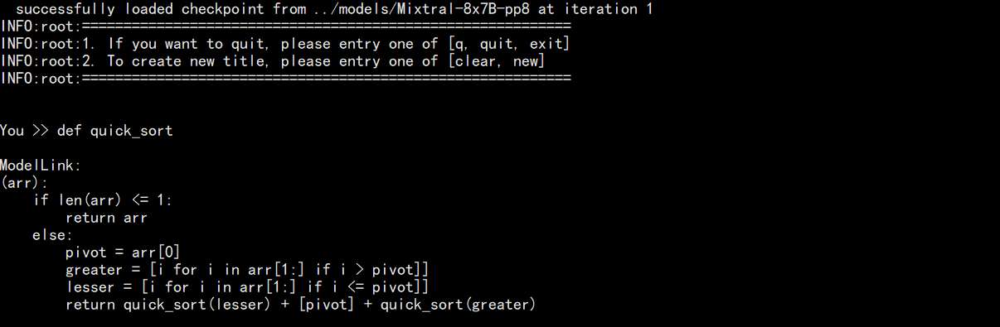

# Mixtral

<p align="left">
        <b><a href="README.md">简体中文</a> </b> |
        <b>English</b> 
</p>

# Table of Contents

- [8x7B](#8x7B)
  - [Hardware Requirements](#Hardware-Requirements)
  - [Preparation](#Preparation)
  - [Data Processing](#Data-Processing)
  - [Model Conversion](#Model-Conversion)
  - [Model Training](#Model-Training)
  - [Model Performance](#Model-Performance)
    - [Throughput](#Throughput)
  - [Model Inference](#Model-Inference)
  - [Model Evaluation](#Model-Evaluation)

# 8x7B

## Hardware-Requirements

Minimum hardware requirements for training:

| Hardware |  Configuration  |
| :------: | :--------------: |
|   NPU   | 16 x Ascend NPUs |

Recommended hardware configuration for inference:

| Hardware |  Configuration  |
| :------: | :-------------: |
|   NPU   | 8 x Ascend NPUs |

## Preparation

1. Clone the code repository to the local server

   ```shell
   git clone https://gitee.com/ascend/ModelLink.git
   cd ModelLink
   mkdir logs
   mkdir model_from_hf
   mkdir dataset
   mkdir ckpt
   ```
2. Set up the environment

   ```bash
   # python3.8
   conda create -n test python=3.8
   conda activate test

   # install torch and torch_npu 
   pip install torch-2.1.0-cp38-cp38m-linux_aarch64.whl
   pip install torch_npu-2.1.0.XXX-cp38-cp38m-linux_aarch64.whl
   pip install apex-0.1_ascend*-cp38-cp38m-linux_aarch64.whl

   # modify the path according to your own  ascend-toolkit path
   source /usr/local/Ascend/ascend-toolkit/set_env.sh 

   # install AscendSpeed
   git clone https://gitee.com/ascend/AscendSpeed.git
   cd AscendSpeed
   pip install -r requirements.txt 
   pip3 install -e .
   cd ..

   # install other packages
   pip install -r requirements.txt 
   ```
3. Download the pre-trained weights and vocabulary for Mixtral-8x7B from [here](https://huggingface.co/mistralai/Mixtral-8x7B-v0.1/tree/main). (It is recommended to only download weights in safetensors format)

   ```shell
   #!/bin/bash
   cd ./model_from_hf/
   git lfs install
   git clone https://huggingface.co/mistralai/Mixtral-8x7B-v0.1
   mv Mixtral-8x7B-v0.1 Mixtral-8x7B
   cd ..

   ```

## Data-Processing

1. Prepare dataset

Download [Alpaca-GPT4 Chinese dataset](https://huggingface.co/datasets/silk-road/alpaca-data-gpt4-chinese/tree/main)

```shell
cd ./dataset

# If wget is not accessible, you can manually download
wget https://huggingface.co/datasets/silk-road/alpaca-data-gpt4-chinese/blob/main/Alpaca_data_gpt4_zh.jsonl

cd ..
```

2. Data preprocessing

```shell
python ./tools/preprocess_data.py \
    --input ./dataset/Alpaca_data_gpt4_zh.jsonl \
    --output-prefix ./dataset/Mixtral-8x7B_alpaca \
    --tokenizer-type PretrainedFromHF \
    --tokenizer-name-or-path ./model_from_hf/Mixtral-8x7B/ \
    --append-eod \
    --tokenizer-not-use-fast \
    --handler-name GeneralInstructionHandler \
    --workers 4
```

## Model-Conversion

1. HuggingFace weights --> Megatron weights with any parallel slicing strategy
   ***(This scenario is generally used to train open-source HuggingFace models on Megatron)***
   ```bash
   # 修改 ascend-toolkit 路径
   source /usr/local/Ascend/ascend-toolkit/set_env.sh

   # HF 转 tp1-pp8-ep2
   python tools/checkpoint/util.py --model-type GPT \
       --loader mixtral_hf \
       --saver mixtral \
       --load-dir ./model_from_hf/Mixtral-8x7B/ \
       --save-dir ./model_weights/Mixtral-8x7B-v0.1-tp1-pp8-ep2/ \
       --tokenizer-model ./model_from_hf/Mixtral-8x7B/tokenizer.model \
       --target-tensor-parallel-size 1 \
       --target-pipeline-parallel-size 8 \
       --target-expert-parallel-size 2 \
       --params-dtype bf16 
   ```
2. Any Megatron weights with parallel slicing strategy --> Any Megatron weights with parallel slicing strategy
   ***(This scenario is generally used to reconfigure the sliced model weights, such as training on a dual-node 16-card EP2-PP8 strategy, and then wanting to infer on a single-node 8-card TP8)***
   ```bash
   # 修改 ascend-toolkit 路径
   source /usr/local/Ascend/ascend-toolkit/set_env.sh

   # tp1-pp8-ep2 转 tp1-pp8-ep1
   python tools/checkpoint/util.py --model-type GPT \
       --loader mixtral_mg \
       --saver mixtral \
       --load-dir ./model_weights/Mixtral-8x7B-v0.1-tp1-pp8-ep2/ \
       --save-dir ./model_weights/Mixtral-8x7B-v0.1-tp1-pp8-ep1/ \
       --target-tensor-parallel-size 1 \
       --target-pipeline-parallel-size 8 \
       --target-expert-parallel-size 1 
   ```
3. Any Megatron weights with parallel slicing strategy --> HuggingFace weights
   ***(This scenario is generally used to convert the trained megatron model back to the HuggingFace format)***
   ```bash
   # 修改 ascend-toolkit 路径
   source /usr/local/Ascend/ascend-toolkit/set_env.sh

   # tp1-pp8-ep2 转 HF
   python tools/checkpoint/util.py --model-type GPT \
       --loader mixtral_mg \
       --saver mixtral \
       --save-model-type huggingface \
       --load-dir ./model_weights/Mixtral-8x7B-v0.1-tp1-pp8-ep2/ \
       --save-dir ./model_from_hf/Mixtral-8x7B/ \    # <-- 需要填入原始HF模型路径，新权重会存于./model_from_hf/Mixtral-8x7B/mg2hg
   ```

## Model-Training

Configure Mixtral-8x7B pre-training script: ***examples/mixtral/pretrain_mixtral_8x7b_ptd.sh***

1. Pre-training

   ```shell

   # Set the ascend-toolkit path
   source /usr/local/Ascend/ascend-toolkit/set_env.sh 

   # Configure according to the actual vocabulary, dataset, and model parameter save path
   DATA_PATH="./dataset/Mixtral-8x7B_alpaca_text_document"
   TOKENIZER_MODEL="./model_from_hf/Mixtral-8x7B/"
   CKPT_SAVE_DIR="./ckpt/"

   # Configure distributed parameters according to the actual distributed cluster
   GPUS_PER_NODE=8
   MASTER_ADDR="your master node IP"
   MASTER_PORT=6000
   NNODES=2
   NODE_RANK="current node id"
   WORLD_SIZE=$(($GPUS_PER_NODE * $NNODES))

   # Training parallel strategy
   TP=1
   PP=8
   EP=2

   # The instruction dataset is used in the previous example with alpaca, so this parameter needs to be added
   # If using a pre-training dataset such as wiki, this is not necessary
   DATA_ARGS="
       ...
       --is-instruction-dataset
       ...
   "
   ```

   Start Mixtral-8x7B pre-training script: ***examples/pretrain_mixtral_8x7b_ptd.sh***

   ```shell
   bash examples/mixtral/pretrain_mixtral_8x7b_ptd.sh
   ```
2. Supervised Fine-Tuning
   The configuration script for fine-tuning is basically the same as the pre-training script pretrain_mixtral_8x7b_ptd.sh. The difference lies in whether to load the model and use the instruction fine-tuning dataset

   ```shell
   # Enable fine-tuning dataset switch
   --is-instruction-dataset
   # Configure the model parameter loading path according to the actual situation
   CKPT_LOAD_DIR="your init model load path"
   --load ${CKPT_LOAD_DIR}
   ```

## Model-Performance

### Throughput

Comparison of Mixtral-8x7B performance on 2 nodes and 16 chips with ep2 pp8:
**(When there are enough nodes, the larger the ep, the higher the throughput. This is not the optimal performance here, just for reference)**

|  Device  |    Model    | Iterations | Sample Throughput (samples/step) | Tokens Throughput (tokens/s/p) | Single Step Iteration Time (s/step) |
| :-------: | :----------: | :--------: | :------------------------------: | :----------------------------: | :---------------------------------: |
|   NPUs   | Mixtral-8x7B |    1000    |               3.13               |            1053.63            |                31.13                |
| Reference | Mixtral-8x7B |    1000    |               4.45               |             1139.3             |                28.76                |

## Model-Inference

First, configure the inference script: ***tasks/inference/generate_mixtral_8x7b_ptd.sh***

```bash
# Execute set_env.sh according to your own ascend-toolkit path
source /usr/local/Ascend/ascend-toolkit/set_env.sh 

# Modify the model weight path and tokenizer path
CHECKPOINT="./model_weights/Mixtral-8x7B-v0.1-tp1-pp8-ep1/"
TOKENIZER_MODEL="./model_from_hf/Mixtral-8x7B/"

# Modify according to the actual loaded model weight the parallel configuration
MASTER_ADDR=localhost
MASTER_PORT=6000
NNODES=1
NODE_RANK=0
GPUS_PER_NODE=8
TP=8
PP=1

# Note
The Mixtral-8x7B-v0.1 model used in this document is an L0 model, only with continuation ability, inference does not involve any templates and is prone to repetition or non-stop answering.

If you want to have better human-machine dialogue capabilities, please use the Mixtral-8x7B-Instruct-v0.1 model. This model requires instruction compliance training and needs to be used with templates. The basic operations are the same as above, only the startup entry has changed:
torchrun $DISTRIBUTED_ARGS tasks/inference/inference_mixtral.py
```

Then you can start it directly

```bash
bash tasks/inference/generate_mixtral_8x7b_ptd.sh
```

An example of inference is as follows:


## Model-Evaluation

Evaluate the model using the MMLU dataset. Dataset download path [here](https://huggingface.co/datasets/cais/mmlu).
Configure the evaluation script: ***tasks/evaluation/evaluate_mixtral_8x7b_ptd.sh***

```bash
# Ascend-toolkit path
source /usr/local/Ascend/ascend-toolkit/set_env.sh 

# Modify the model parameter path and tokenizer path
TOKENIZER_PATH="./model_from_hf/Mixtral-8x7B/"                         #tokenizer path
CHECKPOINT="./model_weights/Mixtral-8x7B-v0.1-tp1-pp8-ep1"                           #model path

# Configure tasks and dataset paths
DATA_PATH="./mmlu/data/test/"
TASK="mmlu"
```

Start the evaluation

```bash
bash tasks/evaluation/evaluate_mixtral_8x7b_ptd.sh
```

The evaluation results are as follows

| Dataset | Dataset | Refer Accuracy | Ours |
| :-----: | :-----: | :------------: | :---: |
|  MMLU  |  14042  |     0.658     | 0.660 |
