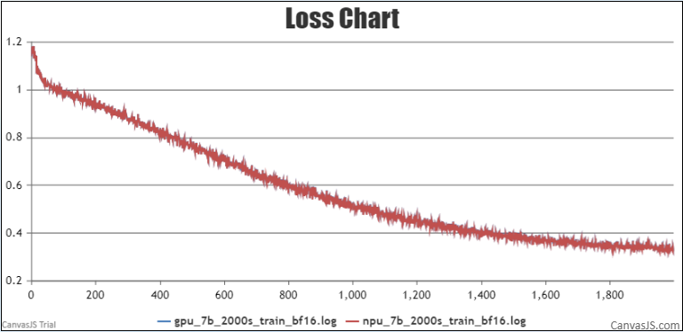
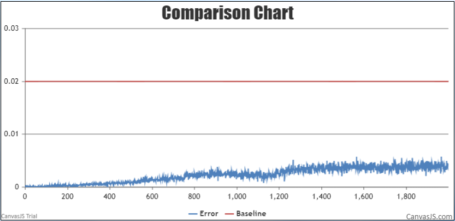
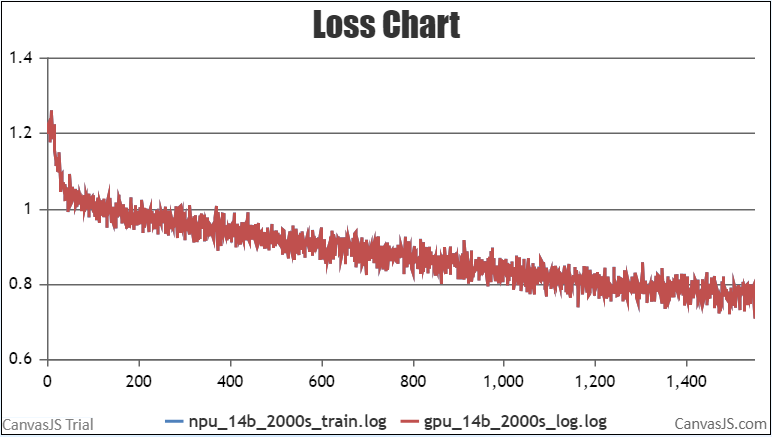
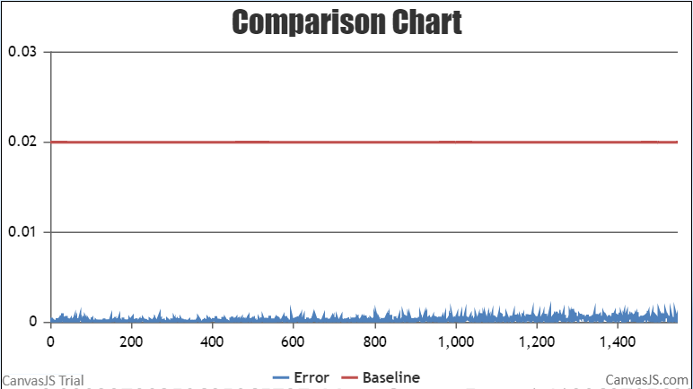

# Qwen

<p align="left">
        <b>简体中文</b> |
        <b><a href="https://gitee.com/ascend/ModelLink/blob/modellink/examples/qwen/README_en.md">English</a> </b> 
</p>

# 目录

- [Qwen-7B](#Qwen-7B)
  - [训练](#训练)
  - [脚本](#脚本)
  - [性能](#性能)
    - [吞吐](#吞吐)
    - [精度](#精度)
  - [推理](#推理)
  - [评估](#评估)

- [Qwen-14B](#Qwen-14B)
  - [训练](#训练)
  - [脚本](#脚本)
  - [性能](#性能)
    - [吞吐](#吞吐)
    - [精度](#精度)
  - [推理](#推理)
  - [评估](#评估)

# Qwen-7B

## 训练

Qwen-7B 训练的硬件配置:

| 硬件 |      配置      |
| :--: | :-------------: |
| NPU | 8 x Ascend NPUs |

### 脚本

1. 拷贝代码仓到本地服务器

   ```shell
   git clone https://gitee.com/ascend/ModelLink.git 
   cd ModelLink 
   git checkout modellink
   ```
2. 搭建环境

   ```bash
   # python3.8
   conda create -n test python=3.8
   conda activate test
   
   # 安装 torch 和 torch_npu
   pip install torch-2.1.0-cp38-cp38m-manylinux2014_aarch64.whl
   pip install torch_npu-2.1.0*-cp38-cp38m-linux_aarch64.whl
   pip install apex-0.1_ascend*-cp38-cp38m-linux_aarch64.whl

   # 安装加速库
   git clone https://gitee.com/ascend/AscendSpeed.git
   cd AscendSpeed
   pip install -r requirements.txt
   pip3 install -e .
   cd ..
   
   # 安装其余依赖库
   pip install -r requirements.txt
   ```
3. 下载 Qwen-7B 的 [预训练权重和词表](https://huggingface.co/Qwen/Qwen-7B/tree/main)

   ```bash
   mkdir -p qwen-7b-hf
   cd qwen-7b-hf
   wget https://huggingface.co/Qwen/Qwen-7B/resolve/main/cache_autogptq_cuda_256.cpp
   wget https://huggingface.co/Qwen/Qwen-7B/resolve/main/cache_autogptq_cuda_kernel_256.cu
   wget https://huggingface.co/Qwen/Qwen-7B/resolve/main/config.json
   wget https://huggingface.co/Qwen/Qwen-7B/resolve/main/configuration_qwen.py
   wget https://huggingface.co/Qwen/Qwen-7B/resolve/main/cpp_kernels.py
   wget https://huggingface.co/Qwen/Qwen-7B/resolve/main/generation_config.json
   wget https://huggingface.co/Qwen/Qwen-7B/resolve/main/model-00001-of-00008.safetensors
   wget https://huggingface.co/Qwen/Qwen-7B/resolve/main/model-00002-of-00008.safetensors
   wget https://huggingface.co/Qwen/Qwen-7B/resolve/main/model-00003-of-00008.safetensors
   wget https://huggingface.co/Qwen/Qwen-7B/resolve/main/model-00004-of-00008.safetensors
   wget https://huggingface.co/Qwen/Qwen-7B/resolve/main/model-00005-of-00008.safetensors
   wget https://huggingface.co/Qwen/Qwen-7B/resolve/main/model-00006-of-00008.safetensors
   wget https://huggingface.co/Qwen/Qwen-7B/resolve/main/model-00007-of-00008.safetensors
   wget https://huggingface.co/Qwen/Qwen-7B/resolve/main/model-00008-of-00008.safetensors
   wget https://huggingface.co/Qwen/Qwen-7B/resolve/main/model.safetensors.index.json
   wget https://huggingface.co/Qwen/Qwen-7B/resolve/main/modeling_qwen.py
   wget https://huggingface.co/Qwen/Qwen-7B/resolve/main/qwen.tiktoken
   wget https://huggingface.co/Qwen/Qwen-7B/resolve/main/qwen_generation_utils.py
   wget https://huggingface.co/Qwen/Qwen-7B/resolve/main/tokenization_qwen.py
   wget https://huggingface.co/Qwen/Qwen-7B/resolve/main/tokenizer_config.json

   cd ..
   ```
4. 准备数据集

   下载 Qwen-7B [数据集](https://huggingface.co/datasets/tatsu-lab/alpaca/resolve/main/data/train-00000-of-00001-a09b74b3ef9c3b56.parquet)

   ```shell
    # 下载数据
    mkdir dataset_qwen-7b
    cd ./dataset_qwen-7b
    wget https://huggingface.co/datasets/tatsu-lab/alpaca/resolve/main/data/train-00000-of-00001-a09b74b3ef9c3b56.parquet
    cd ..
     
    # 处理数据                           
    python ./tools/preprocess_data.py \
        --input ../dataset_qwen-7b/train-00000-of-00001-a09b74b3ef9c3b56.parquet \
        --tokenizer-name-or-path ../qwen-7b-hf \
        --output-prefix ../dataset_qwen-7b/alpaca \
        --tokenizer-type PretrainedFromHF \
        --seq-length 8192 \
        --workers 4 \
        --log-interval 1000 \
    
    cd .. 
   ```
5. 微调

    配置Qwen-7B 预训练脚本: examples/qwen/pretrain_qwen_7b_ptd.sh

   ```shell
    # 设置 ascend-toolkit 路径
    source /usr/local/Ascend/ascend-toolkit/set_env.sh 
   
    # 根据实际情况配置词表、数据集、模型参数保存路径
    CKPT_SAVE_DIR="your model ckpt save path"
    TOKENIZER_MODEL="./qwen-7b-hf/"  #词表路径
    DATA_PATH="./dataset_qwen-7b/alpaca_text_document"  #数据集路径
    CKPT_LOAD_DIR="./qwen-7b-mt/"
   ```

   启动 Qwen-7B 预训练脚本: examples/qwen/pretrain_qwen_7b_ptd.sh

   ```shell
    bash examples/qwen/pretrain_qwen_7b_ptd.sh
   ```


### 性能

#### 吞吐

Qwen-7B 在 **昇腾芯片** 和 **参考芯片** 上的性能对比：

|  设备  |   模型    | 迭代数  | tokens吞吐 (tokens/s/p) |
|:----:|:-------:|:----:|:---------------------:|
| NPUs | Qwen-7B | 2000 |         2499          |
|  参考  | Qwen-7B | 2000 |         2867          |

#### 精度

NPU vs 参考loss.



NPU vs 参考loss相对误差.



## 推理

配置 qwen-7b 推理脚本：tasks/inference/generate_qwen_7b_ptd.sh

```bash
# ascend-toolkit 路径
source /usr/local/Ascend/ascend-toolkit/set_env.sh

# 修改模型权重路径和此表路径
CHECKPOINT="your model directory path"
TOKENIZER_PATH="your tokenizer path"
```

启动qwen-14B 推理脚本
```bash
bash tasks/inference/generate_qwen_7b_ptd.sh
```

推理示例如下：


## 评估

使用 MMLU数据集评估模型. 数据集下载路径 [这里](https://huggingface.co/datasets/cais/mmlu). 
配置qwen-7b评估脚本: tasks/evaluation/evaluate_qwen_7b_ptd.sh

```bash
# ascend-toolkit 路径
source /usr/local/Ascend/ascend-toolkit/set_env.sh 

# 修改模型参数路径和词表路径
TOKENIZER_PATH=./qwen-7b-hf  #词表路径
CHECKPOINT=./qwen-7b-t8p1  #模型路径
# 配置任务和数据集路径
DATA_PATH="./mmlu/data/test/"
TASK="mmlu"
```

启动评估

```bash
bash tasks/evaluation/evaluate_qwen_7b_ptd.sh
```

评估结果如下

```text
                           学科名             问题数  NPU准确率
0                     us_foreign_policy         100  0.830000
1                           human_aging         223  0.623318
2                     international_law         121  0.743802
3                   high_school_physics         151  0.397351
4                          global_facts         100  0.370000
5                      machine_learning         112  0.410714
6                   high_school_biology         310  0.719355
7                            management         103  0.747573
8                high_school_us_history         204  0.735294
9                             sociology         201  0.786070
10                high_school_chemistry         203  0.487685
11                         econometrics         114  0.315789
12                     public_relations         110  0.636364
13                      college_physics         102  0.401961
14               high_school_statistics         216  0.435185
15                  college_mathematics         100  0.330000
16             college_computer_science         100  0.550000
17                           prehistory         324  0.679012
18                      human_sexuality         131  0.694656
19                high_school_geography         198  0.757576
20           high_school_microeconomics         238  0.609244
21         high_school_computer_science         100  0.670000
22                        miscellaneous         783  0.777778
23               elementary_mathematics         378  0.428571
24               electrical_engineering         145  0.544828
25                      moral_scenarios         895  0.289385
26                      world_religions         171  0.771930
27                     college_medicine         173  0.601156
28               high_school_psychology         545  0.805505
29                        jurisprudence         108  0.796296
30                    college_chemistry         100  0.500000
31                       moral_disputes         346  0.641618
32                     security_studies         245  0.718367
33         high_school_european_history         165  0.672727
34            high_school_world_history         237  0.767932
35                     professional_law        1534  0.430900
36                            astronomy         152  0.611842
37                    logical_fallacies         163  0.687117
38                professional_medicine         272  0.577206
39              high_school_mathematics         270  0.281481
40                         formal_logic         126  0.412698
41                   conceptual_physics         235  0.540426
42                            marketing         234  0.824786
43  high_school_government_and_politics         193  0.829016
44                      business_ethics         100  0.650000
45           high_school_macroeconomics         390  0.607692
46                           philosophy         311  0.668810
47                      college_biology         144  0.659722
48                            nutrition         306  0.637255
49                   clinical_knowledge         265  0.618868
50                             virology         166  0.475904
51              professional_psychology         612  0.594771
52                     abstract_algebra         100  0.310000
53              professional_accounting         282  0.418440
54                              anatomy         135  0.488889
55                     medical_genetics         100  0.620000
56                    computer_security         100  0.720000
57                                total       14042  0.581256
```

|  数据集 | 总学科数  |总问题数  |参考准确率|NPU准确率|
|:---:|:---:|:---:|:---:|:---:|
| MMLU | 57| 14042 |0.5813|0.582|

# Qwen-14B

## 训练

Qwen-14B 训练的硬件配置:

| 硬件 |      配置      |
| :--: | :-------------: |
| NPU | 8 x Ascend NPUs |

### 脚本

1. 拷贝代码仓到本地服务器

   ```shell
   git clone -b modellink https://gitee.com/ascend/ModelLink.git 
   cd ModelLink 
   ```
2. 搭建环境

   ```bash
   # python3.8
   conda create -n test python=3.8
   conda activate test
   
   # 安装 torch 和 torch_npu
   pip install torch-2.1.0-cp38-cp38m-manylinux2014_aarch64.whl
   pip install torch_npu-2.1.0*-cp38-cp38m-linux_aarch64.whl
   pip install apex-0.1_ascend*-cp38-cp38m-linux_aarch64.whl

   # 安装加速库
   git clone https://gitee.com/ascend/AscendSpeed.git
   cd AscendSpeed
   pip install -r requirements.txt
   pip3 install -e .
   cd ..
   
   # 安装其余依赖库
   pip install -r requirements.txt
   ```
3. 下载 Qwen-14B 的 [预训练权重和词表](https://huggingface.co/Qwen/Qwen-14B/tree/main)

   ```bash
   mkdir -p qwen-14B-hf
   cd qwen-14B-hf
   wget https://huggingface.co/Qwen/Qwen-14B/resolve/main/cache_autogptq_cuda_256.cpp
   wget https://huggingface.co/Qwen/Qwen-14B/resolve/main/cache_autogptq_cuda_kernel_256.cu
   wget https://huggingface.co/Qwen/Qwen-14B/resolve/main/config.json
   wget https://huggingface.co/Qwen/Qwen-14B/resolve/main/configuration_qwen.py
   wget https://huggingface.co/Qwen/Qwen-14B/resolve/main/cpp_kernels.py
   wget https://huggingface.co/Qwen/Qwen-14B/resolve/main/generation_config.json
   wget https://huggingface.co/Qwen/Qwen-14B/resolve/main/model-00001-of-00015.safetensors
   wget https://huggingface.co/Qwen/Qwen-14B/resolve/main/model-00002-of-00015.safetensors
   wget https://huggingface.co/Qwen/Qwen-14B/resolve/main/model-00003-of-00015.safetensors
   wget https://huggingface.co/Qwen/Qwen-14B/resolve/main/model-00004-of-00015.safetensors
   wget https://huggingface.co/Qwen/Qwen-14B/resolve/main/model-00005-of-00015.safetensors
   wget https://huggingface.co/Qwen/Qwen-14B/resolve/main/model-00006-of-00015.safetensors
   wget https://huggingface.co/Qwen/Qwen-14B/resolve/main/model-00007-of-00015.safetensors
   wget https://huggingface.co/Qwen/Qwen-14B/resolve/main/model-00008-of-00015.safetensors
   wget https://huggingface.co/Qwen/Qwen-14B/resolve/main/model-00009-of-00015.safetensors
   wget https://huggingface.co/Qwen/Qwen-14B/resolve/main/model-00010-of-00015.safetensors
   wget https://huggingface.co/Qwen/Qwen-14B/resolve/main/model-00011-of-00015.safetensors
   wget https://huggingface.co/Qwen/Qwen-14B/resolve/main/model-00012-of-00015.safetensors
   wget https://huggingface.co/Qwen/Qwen-14B/resolve/main/model-00013-of-00015.safetensors
   wget https://huggingface.co/Qwen/Qwen-14B/resolve/main/model-00014-of-00015.safetensors
   wget https://huggingface.co/Qwen/Qwen-14B/resolve/main/model-00015-of-00015.safetensors
   wget https://huggingface.co/Qwen/Qwen-14B/resolve/main/model.safetensors.index.json
   wget https://huggingface.co/Qwen/Qwen-14B/resolve/main/modeling_qwen.py
   wget https://huggingface.co/Qwen/Qwen-14B/resolve/main/qwen.tiktoken
   wget https://huggingface.co/Qwen/Qwen-14B/resolve/main/qwen_generation_utils.py
   wget https://huggingface.co/Qwen/Qwen-14B/resolve/main/tokenization_qwen.py
   wget https://huggingface.co/Qwen/Qwen-14B/resolve/main/tokenizer_config.json

   cd ..
   ```
4. 准备数据集

   下载 Qwen-14B [数据集](https://huggingface.co/datasets/tatsu-lab/alpaca/resolve/main/data/train-00000-of-00001-a09b74b3ef9c3b56.parquet)

   ```shell
    # 下载数据
    mkdir dataset_qwen-14b
    cd ./dataset_qwen-14b
    wget https://huggingface.co/datasets/tatsu-lab/alpaca/resolve/main/data/train-00000-of-00001-a09b74b3ef9c3b56.parquet
    cd ..
     
    # 处理数据                           
    python ./tools/preprocess_data.py \
        --input ../dataset_qwen-14b/train-00000-of-00001-a09b74b3ef9c3b56.parquet \
        --tokenizer-name-or-path ../qwen-14b-hf \
        --output-prefix ../dataset_qwen-14b/alpaca \
        --tokenizer-type PretrainedFromHF \
        --seq-length 2048 \
        --workers 4 \
        --log-interval 1000 \
    
    cd .. 
   ```
5. 微调

    配置Qwen-14B 预训练脚本: examples/qwen/pretrain_qwen_14b_ptd.sh

   ```shell
    # 设置 ascend-toolkit 路径
    source /usr/local/Ascend/ascend-toolkit/set_env.sh 
   
    # 根据实际情况配置词表、数据集、模型参数保存路径
    CKPT_SAVE_DIR="your model ckpt save path"
    TOKENIZER_MODEL="./qwen-14b-hf/"  #词表路径
    DATA_PATH="./dataset_qwen-14b/alpaca_text_document"  #数据集路径
    CKPT_LOAD_DIR="./qwen-14b-mt/"
   ```

   启动 Qwen-14B 预训练脚本: examples/qwen/pretrain_qwen_14b_ptd.sh

   ```shell
    bash examples/qwen/pretrain_qwen_14b_ptd.sh
   ```


### 性能

#### 吞吐

Qwen-14B 在 **昇腾芯片** 和 **参考芯片** 上的性能对比：

|  设备  |   模型    | 迭代数  | tokens吞吐 (tokens/s/p) |
|:----:|:-------:|:----:|:---------------------:|
| NPUs | Qwen-14B | 2000 |         1560          |
|  参考  | Qwen-14B | 2000 |         -          |

#### 精度

NPU vs 参考loss.



NPU vs 参考loss相对误差.



## 推理

配置qwen-14B推理脚本：tasks/inference/generate_qwen_14b_ptd.sh

```bash
# ascend-toolkit 路径
source /usr/local/Ascend/ascend-toolkit/set_env.sh

# 修改模型权重路径和此表路径
CHECKPOINT="your model directory path"
TOKENIZER_PATH="your tokenizer path"
```

启动qwen-14B 推理脚本
```bash
bash tasks/inference/generate_qwen_14b_ptd.sh
```

推理示例如下：


## 评估

使用 MMLU数据集评估模型. 数据集下载路径 [这里](https://huggingface.co/datasets/cais/mmlu). 
配置qwen-14B评估脚本: tasks/evaluation/evaluate_qwen_14b_ptd.sh

```bash
# ascend-toolkit 路径
source /usr/local/Ascend/ascend-toolkit/set_env.sh 

# 修改模型参数路径和词表路径
TOKENIZER_PATH=./qwen-14b-hf  #词表路径
CHECKPOINT=./qwen-14b-t8p1  #模型路径
# 配置任务和数据集路径
DATA_PATH="./mmlu/data/test/"
TASK="mmlu"
```

启动评估

```bash
bash tasks/evaluation/evaluate_qwen_14b_ptd.sh
```

评估结果如下

```text

```

|  数据集 | 总学科数  |总问题数  |参考准确率|NPU准确率|
|:---:|:---:|:---:|:---:|:---:|
| MMLU | 57| 14042 |0.4691|0.4698|