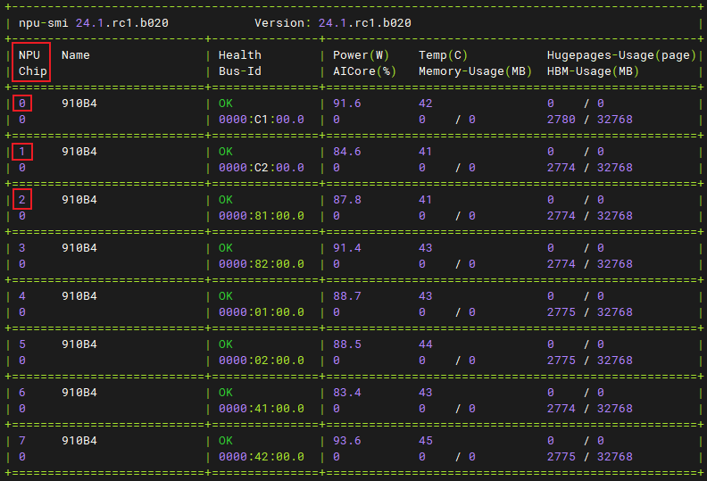
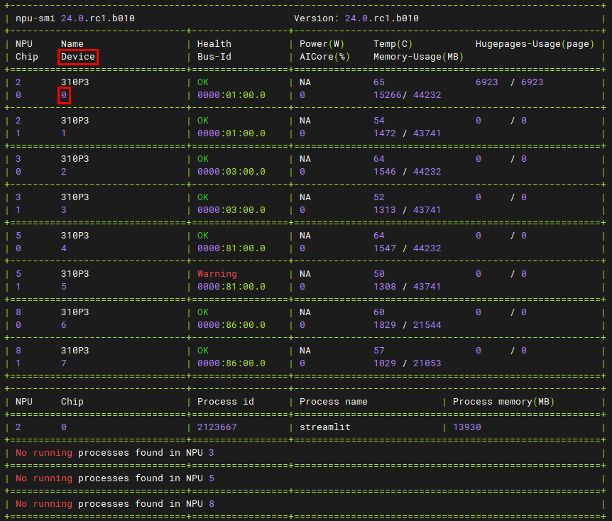

# README

- 此README对各模型统一的脚本及其使用方式进行介绍

## 路径变量解释
| 变量名  | 含义                                             |
|--------|--------------------------------------------------|
| working_dir | 加速库及模型库下载后放置目录                  |
| llm_path | 模型仓所在路径。若使用编译好的包，则路径为`${working_dir}/ModelLink/`；若使用gitee下载的代码，则路径为`${working_dir}/ModelLink/mindie_ref/mindie_llm/atb_models`    |
| weight_path | 模型权重路径                                 |
| cur_dir | 运行指令或执行脚本时的路径（当前目录）                  |

## 权重

### 权重设置
- `${weight_path}/config.json`文件中需设置`dtype`和`quantize`类型来标识权重的量化类型和精度
  - 若`dtype`和`quantize`字段不存在，需新增

- 配置
  | 量化类型及精度  | torch_dtype | quantize |
  |----------------|-------------|----------|
  | FP16           | "float16"   | 无       |
  | BF16           | "bfloat16"  | 无       |
  | W8A8           | "float16"   | "w8a8"   |
  | W8A16          | "float16"   | "w8a16"  |

- 示例
  - LLaMa模型的权重使用BF16精度，非量化
    ```json
    {
      "architectures": [
        "LlamaForCausalLM"
      ],
      ...
      "torch_dtype": "bfloat16",
      ...
    }
    ```
  - LLaMa模型的权重使用FP16精度，W8A16量化
    ```json
    {
      "architectures": [
        "LlamaForCausalLM"
      ],
      ...
      "torch_dtype": "float16",
      ...
      "quantize": "w8a16",
    }
    ```

### 权重转换
> 当前仅支持加载safetensor格式的权重文件，若环境中已有bin格式的权重文件，请按照如下方式进行转换
> 若当前环境不存在模型权重，请至hugging face官网下载
- 使用`${llm_path}/examples/convert/convert_weights.py`将bin转成safetensor格式
- 示例
    ```shell
    cd ${llm_path}
    python examples/convert/convert_weights.py --model_path ${weight_path}
    ```
  - 注意：必须先进入`${llm_path}`路径下执行以上命令，否则由于脚本中存在相对路径，会导致moudle not found的问题
- 输出结果会保存在bin权重同目录下

## 启动脚本
- Flash Attention的启动脚本路径为`${llm_path}/examples/run_fa.py`
- Page Attention的启动脚本路径为`${llm_path}/examples/run_pa.py`

### 启动脚本相关环境变量
  - `USE_ASCEND`
    - 是否使用昇腾加速库
    - 设置为1使用加速库，设置为0则不使用加速库；默认使用
  - `MAX_MEMORY_GB`
    - 限制最大显存
    - 默认在服务器最大显存GB的基础上预留3GB显存
    - 若出现显存不足导致的异常，请将该参数改小
  - `ASCEND_RT_VISIBLE_DEVICES`
    - 指定当前机器上可用的逻辑NPU核心，多个核心间使用逗号相连
    - 核心编号需要通过 npu-smi info 指令查阅
    - Atlas 800I A2服务器需基于输出的 NPU 列查阅
        
    - Atlas 300I DUO服务器需基于输出的 Device 列查阅
        
        - 若要使用单卡双芯，请指定至少两个可见核心；若要使用双卡四芯，请指定至少四个可见核心
  - `BIND_CPU`
    - 绑定CPU核心开关
    - 设置为1进行绑核，设置为0则不绑核；默认进行绑核
    - 若当前机器未设置NUMA或绑核失败，可将 BIND_CPU 设为 0
  - `ATB_PROFILING_ENABLE`
    - 是否落性能profiling文件
    - 设置为1生成profiling文件，设置为0则不生成；默认不生成profiling文件
  - `PROFILING_FILEPATH`
    - （若生成profiling文件）profiling文件的路径
    - 默认为`${cur_dir}/profiling`
  - `ATB_LLM_BENCHMARK_ENABLE`
    - 是否统计端到端和各token的性能数据
    - 设置为1统计耗时，设置为0则不统计；默认不统计
  - `ATB_LLM_BENCHMARK_FILEPATH`
    - 性能数据的保存路径
    - 默认为`${cur_dir}/benchmark_result/benchmark.csv`

### run_fa.py脚本参数
- `--model_path`
  - 模型权重路径
- `--input_text`
  - 输入问题
  - 支持字符串列表或者字符串
  - 若此值为字符串，则构造推理输入时会基于batch size入参复制多份
  - 若此值为列表，则构造推理输入时会忽略batch size入参，真实的batch size为此列表实际长度
- `--max_input_length`
  - 最大输入长度
  - 默认512个token
  - 若输入长度不足512个token，会自动使用padding补齐
- `--max_output_length`
  - 最大输出长度
  - - 默认输出20个token
- `--batch_size`
  - 推理时固定的batch数量
  - 默认单batch
- `--is_flash_causal_lm`
  - 是否使用Paged Attention，默认不使用
- `--use_refactor`
    - 若设置为True则使用归一后代码，若设置为False，则使用未归一的代码；默认开启use_refactor
- 示例
  ```shell
  # 使用多卡运行Flash Attention，设置模型权重路径，设置输出长度为2048个token，精度使用BF16
  torchrun --nproc_per_node 2 --master_port 20038 -m examples.run_fa --model_path ${weight_path} --max_output_length 2048 --is_bf16
  ```

### run_pa.py脚本参数
- `--model_path`
  - 模型权重路径
- `--input_text`
  - 输入问题
  - 支持字符串列表或者字符串
  - 若此值为单元素列表或字符串，则构造推理输入时会基于batch size入参复制多份
  - 若此值为多元素列表，则构造推理输入时会忽略batch size入参，真实的batch size为此列表实际长度
- `--max_position_embeddings`
  - 模型可接受的最长输入长度
  - 默认从模型权重的config文件中读取
- `--max_output_length`
  - 最大输出长度
  - - 默认输出20个token
- `--max_prefill_tokens`
  - Prefill推理阶段，最大输入长度
  - 默认4096个token
- `--max_batch_size`
  - 最大batch size，实际运行的batch size动态变化，有可能达不到设置的最大batch size
  - 默认单batch
- `--is_flash_model`
  - 是否使用Paged Attention，默认使用
- `--use_refactor`
    - 若设置为True则使用归一后代码，若设置为False，则使用未归一的代码；默认开启use_refactor
- 示例
  ```shell
  # 使用多卡运行Paged Attention，设置模型权重路径，设置输出长度为2048个token，使用归一后代码
  torchrun --nproc_per_node 2 --master_port 20038 -m examples.run_pa --model_path ${weight_path} --max_output_length 2048 --use_refactor True
  ```

### topktopp调用方法和意义
  - 在pa_runner.infer中设置do_sample=True启用sample search, 否则使用greedy search
- `--top_k`
  - 进行sample search每一次选择前top_k个tokens作为基数再进行采样，取值为大于0的整数
- `--top_p`
  - 进行sample search每一次选择softmax后累计和大于top_p的tokens作为基数再进行采样，取值为0-1的浮点数
- `--temperature`
  - 温度调节，temperature值越大，采样基数tokens得分越平均，结果越随机；temperature值越小，采样基数tokens得分越陡峭，结果越集中。默认取值为1
- `--min_tokens_to_keep`
  -  进行topktopp运算后最小保留tokens个数
- `--random_seed：`
  - 随机种子，数值影响采样结果
  