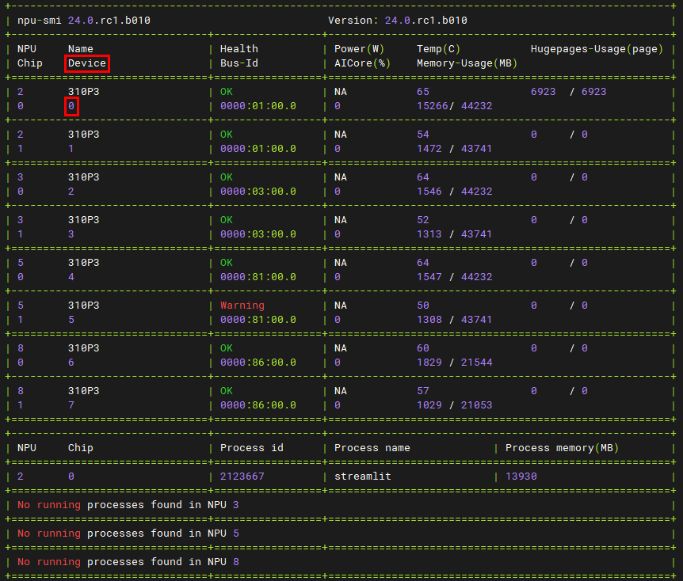

# README

- [LLaMA（Large Language Model Meta AI）](https://github.com/facebookresearch/llama/tree/llama_v1)和 [LLaMA2（Large Language Model Meta AI 2）](https://github.com/facebookresearch/llama)，是由 Meta AI 发布的一个开放且高效的大型基础语言模型，可以通过自然语言交互的方式提供知识、文本生成、语言翻译、语言理解、代码编写和解释等任务。

- 此代码仓中实现了一套基于NPU硬件的LLaMa推理模型。配合加速库使用，旨在NPU上获得极致的推理性能。

# 特性矩阵
- 此矩阵罗列了各LLaMa模型支持的特性

| 模型及参数量 | 800I A2 Tensor Parallelism | 300I DUO Tensor Parallelism | FP16 | BF16 | Flash Attention | Paged Attention | W8A8量化 | KV cache量化 | 稀疏量化 | MOE量化 | MindIE | TGI |
|-------------|-------------------------|-------------------------|------|------|-----------------|-----------------|---------|--------------|----------|--------|--------|-----|
| LLaMa-7B    | 支持world size 1,2,4,8   | 支持world size 2,4      | 是   | 是   | 是              | 是              | 否       | 否           | 否       | 否     | 是     | 否  |
| LLaMa-13B   | 支持world size 1,2,4,8   | 支持world size 2,4      | 是   | 是   | 是              | 是              | 否       | 否           | 否       | 否     | 是     | 否  |
| LLaMa-33B   | 支持world size 4,8       | 否                      | 是   | 是   | 是              | 是              | 否       | 否           | 否       | 否     | 否     | 否  |
| LLaMa-65B   | 支持world size 8         | 否                      | 是   | 是   | 是              | 是              | 否       | 否           | 否       | 否     | 是     | 否  |
| LLaMa2-7B   | 支持world size 1,2,4,8   | 支持world size 2,4      | 是   | 是   | 是              | 是              | 是       | 否           | 是       | 否     | 是     | 否  |
| LLaMa2-13B  | 支持world size 1,2,4,8   | 支持world size 2,4      | 是   | 是   | 是              | 是              | 是       | 否           | 是       | 否     | 是     | 否  |
| LLaMa2-70B  | 支持world size 8         | 否                      | 是   | 是   | 是              | 是              | 否       | 否           | 否       | 否     | 是     | 否  |

# 使用说明

## 环境准备

**激活CANN**
```shell
source /usr/local/Ascend/ascend-toolkit/set_env.sh
```

**安装加速库**
- 获取Ascend-cann-atb_*_cxx11abi*_linux-{x86/aarch64}.run
- 安装
    ```shell
    chmod +x Ascend-cann-atb_*_cxx*abi*_linux-{x86/aarch64}.run
    ./Ascend-cann-atb_*_cxx*abi*_linux-{x86/aarch64}.run --install --install-path=YOUR_PATH
    source YOUR_PATH/atb/set_env.sh
    ```
- 可以使用`uname -a`指令查看服务器是x86还是aarch架构

**获取模型仓代码**
- 获取模型仓代码
    ```shell
    git clone https://gitee.com/ascend/ModelLink.git
    ```
- 代码编译
    ```shell
    cd mindie_ref/mindie_llm/atb_models
    bash scripts/build.sh --use_cxx11_abi={0/1}
    cd output/atb/
    source set_env.sh
    ```
- 可以使用以下指令查看cxx11abi是0还是1
    ```shell
    python
    import torch
    torch.compiled_with_cxx11_abi()
    ```
    - 若输出结果为True表示cxx11abi1，False表示cxx11abi0

## 权重转换
> 当前仅支持加载safetensor格式的权重文件，若环境中已有bin格式的权重文件，请按照如下方式进行转换
> 若当前环境不存在模型权重，请至hugging face官网下载
- 使用`/path-to-ModelLink/mindie_ref/mindie_llm/atb_models/examples/convert/convert_weights.py`将bin转成safetensor格式
- 示例
    ```shell
    python /path-to-ModelLink/mindie_ref/mindie_llm/atb_models/examples/convert/convert_weights.py --model_path {bin文件权重的路径}
    ```
- 输出结果会保存在bin权重同目录下

## 启动脚本
- Flash Attention的启动脚本路径为`/path-to-ModelLink/mindie_ref/mindie_llm/atb_models/examples/run_fa.py`
- Page Attention的启动脚本路径为`/path-to-ModelLink/mindie_ref/mindie_llm/atb_models/examples/run_pa.py`
- 参数说明
    - `--model_path` 模型路径
    - `--input_text` 输入问题
    - `--input_file` 已文件形式批量传入输入问题，输入需经过tokenizer转换为token id
    - `--max_input_length` 最大输入长度
    - `--max_output_length` 最大输出长度
    - `--batch_size` 每次运行时固定的batch数量
    - `--is_flash_causal_lm`
        - Flash Attention时应设为False，Paged Attention时应设为True
        - `run_fa.py`和`run_pa.py`脚本已自动做过适配，无需手动传入
    - `--is_bf16`
        - 默认精度为`FP16`，若运行时传入此参数，则精度设置为`BF16`
        - 注意：当前仅Paged Attention支持打开此开关
    - `--use_refactor`
        - 若加上`use_refactor`则使用归一后代码，若不开启`use_refactor`，则使用未归一前的代码
        - 注意：当前Flash Attention仅支持打开此开关

## 300I DUO 运行操作说明

### 对话测试
- 设置环境变量
    ```shell
    # 绑定CPU核心开关，若当前机器未设置NUMA或绑核失败，可将 BIND_CPU 设为 0
    export BIND_CPU=1
    # 量化开关，默认为 0，若需要开启请参照文档/path-to-ModelLink/mindie_ref/mindie_llm/atb_models/atb_llm/models/llama/small/readme.md
    export IS_QUANT=0
    # 指定当前机器上可用的逻辑NPU核心
    # 核心编号需要通过 npu-smi info 指令输出的 Device 列查阅
    # 若要使用单卡双芯，请指定至少两个可见核心；若要使用双卡四芯，请指定至少四个可见核心
    export ASCEND_RT_VISIBLE_DEVICES=0,1,2,3
    # 限制最大内存，若出现内存不足导致的异常，请将该参数改小
    export MAX_MEMORY_GB=15
    ```
- 查阅核心编号方法

- 运行指令

    ```shell
    torchrun --nproc_per_node {TP数，即world size} --master_port {卡间通信端口} -m examples.run_pa --model_path {模型的权重路径}
    ```

    - 在/path-to-ModelLink/mindie_ref/mindie_llm/atb_models/路径下运行以上指令
    - 各模型支持的TP数参考“特性矩阵”
    - 设置“卡间通信端口”的目的是为了避免同一台机器同时运行两个多卡模型时出现通信冲突，设置时端口建议范围：20000-20050
    - “单卡双芯”运行请指定`--nproc_per_node`为`2`，“双卡四芯”运行请指定`--nproc_per_node`为`4`
    - 示例：

        ```shell
        torchrun --nproc_per_node 2 --master_port 20010 -m examples.run_pa --model_path {LLaMa-7B模型的权重路径}
        torchrun --nproc_per_node 2 --master_port 20010 -m examples.run_pa --model_path {LLaMa-13B模型的权重路径}
        torchrun --nproc_per_node 4 --master_port 20010 -m examples.run_pa --model_path {LLaMa2-7B模型的权重路径}
        torchrun --nproc_per_node 4 --master_port 20010 -m examples.run_pa --model_path {LLaMa2-13B模型的权重路径}
        ```

## 800I A2 运行操作说明

### 对话测试
**运行Flash Attention FP16**
- 设置环境变量
    ```shell
    export ATB_LAYER_INTERNAL_TENSOR_REUSE=1
    export INF_NAN_MODE_ENABLE=0
    export ATB_OPERATION_EXECUTE_ASYNC=1
    export TASK_QUEUE_ENABLE=1
    export ATB_CONVERT_NCHW_TO_ND=1
    export HCCL_BUFFSIZE=120
    export HCCL_WHITELIST_DISABLE=1
    export ATB_CONTEXT_WORKSPACE_RING=1
    export ATB_CONTEXT_WORKSPACE_SIZE=2629145600
    export ATB_WORKSPACE_MEM_ALLOC_GLOBAL=0
    export ATB_LAUNCH_KERNEL_WITH_TILING=0
    export ATB_OPSRUNNER_KERNEL_CACHE_GLOABL_COUNT=1
    export ATB_OPSRUNNER_KERNEL_CACHE_LOCAL_COUNT=0
    ```
        - 使用`export ASCEND_RT_VISIBLE_DEVICES=0,1,2,3` 指定运行的显卡id

    - 运行指令
    ```shell
    torchrun --nproc_per_node {TP数，即world size} --master_port {卡间通信端口} -m examples.run_fa --model_path {模型的权重路径}
    ```
    - 在/path-to-ModelLink/mindie_ref/mindie_llm/atb_models/路径下运行以上指令
    - 各模型支持的TP数参考“特性矩阵”
    - 设置“卡间通信端口”的目的是为了避免同一台机器同时运行两个多卡模型时出现通信冲突，设置时端口建议范围：20000-20050
    - 示例
        ```shell
        torchrun --nproc_per_node 1 --master_port 20010 -m examples.run_fa --model_path {LLaMa-7B模型的权重路径}
        torchrun --nproc_per_node 1 --master_port 20010 -m examples.run_fa --model_path {LLaMa-13B模型的权重路径}
        torchrun --nproc_per_node 4 --master_port 20010 -m examples.run_fa --model_path {LLaMa-33B模型的权重路径}
        torchrun --nproc_per_node 8 --master_port 20010 -m examples.run_fa --model_path {LLaMa-65B模型的权重路径}
        torchrun --nproc_per_node 1 --master_port 20010 -m examples.run_fa --model_path {LLaMa2-7B模型的权重路径}
        torchrun --nproc_per_node 1 --master_port 20010 -m examples.run_fa --model_path {LLaMa2-13B模型的权重路径}
        torchrun --nproc_per_node 8 --master_port 20010 -m examples.run_fa --model_path {LLaMa2-70B模型的权重路径}
        ```

**运行Flash Attention BF16**
- 暂不支持

**运行Paged Attention FP16**
- 设置环境变量
    ```shell
    export ATB_LAYER_INTERNAL_TENSOR_REUSE=1
    export INF_NAN_MODE_ENABLE=0
    export ATB_OPERATION_EXECUTE_ASYNC=1
    export TASK_QUEUE_ENABLE=1
    export ATB_CONVERT_NCHW_TO_ND=1
    export LCCL_ENABLE_FALLBACK=1
    ```

- 运行指令
    ```shell
    torchrun --nproc_per_node {TP数，即world size} --master-port {卡间通信端口} -m examples.run_pa --model_path {模型的权重路径}
    ```
    - 在/path-to-ModelLink/mindie_ref/mindie_llm/atb_models/路径下运行以上指令
    - 示例
        ```shell
        torchrun --nproc_per_node 1 --master_port 20010 -m examples.run_pa --model_path {LLaMa-7B模型的权重路径}
        torchrun --nproc_per_node 1 --master_port 20010 -m examples.run_pa --model_path {LLaMa-13B模型的权重路径}
        torchrun --nproc_per_node 4 --master_port 20010 -m examples.run_pa --model_path {LLaMa-33B模型的权重路径}
        torchrun --nproc_per_node 8 --master_port 20010 -m examples.run_pa --model_path {LLaMa-65B模型的权重路径}
        torchrun --nproc_per_node 1 --master_port 20010 -m examples.run_pa --model_path {LLaMa2-7B模型的权重路径}
        torchrun --nproc_per_node 1 --master_port 20010 -m examples.run_pa --model_path {LLaMa2-13B模型的权重路径}
        torchrun --nproc_per_node 8 --master_port 20010 -m examples.run_pa --model_path {LLaMa2-70B模型的权重路径}
        ```

**运行Paged Attention BF16**
- 设置环境变量
    ```shell
    export ATB_LAYER_INTERNAL_TENSOR_REUSE=1
    export INF_NAN_MODE_ENABLE=0
    export ATB_OPERATION_EXECUTE_ASYNC=1
    export TASK_QUEUE_ENABLE=1
    export ATB_CONVERT_NCHW_TO_ND=1
    export LCCL_ENABLE_FALLBACK=1
    ```

- 运行指令
    ```shell
    torchrun --nproc_per_node {TP数，即world size} --master-port {卡间通信端口} -m examples.run_pa --model_path {模型的权重路径} --is_bf16
    ```
    - 在/path-to-ModelLink/mindie_ref/mindie_llm/atb_models/路径下运行以上指令
    - 示例
        ```shell
        torchrun --nproc_per_node 8 --master_port 20010 -m examples.run_pa --model_path {LLaMa-65B模型的权重路径} --is_bf16
        torchrun --nproc_per_node 8 --master_port 20010 -m examples.run_pa --model_path {LLaMa2-70B模型的权重路径} --is_bf16
        ```

**运行W8A8量化**
- 待补充

**运行KV cache量化**
- 待补充

**运行稀疏量化**
- 待补充

**运行MOE量化**
- 待补充

## 精度测试
- 参考tests/modeltest/README.md

## 性能测试
- 参考tests/modeltest/README.md

## 性能数据
- 待补充